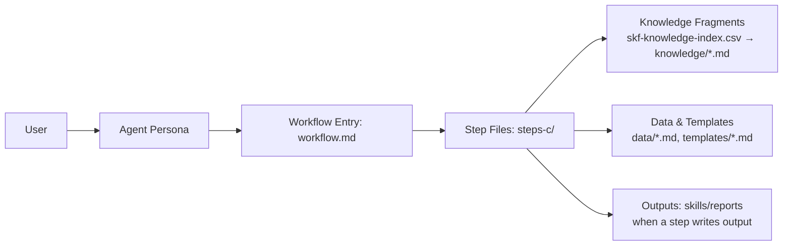

<div align="center">


# Skill Forge (SKF)

**Agent Skill Compiler — AST-verified, version-pinned, zero hallucination**

[](https://github.com/armelhbobdad/bmad-module-skill-forge/actions/workflows/quality.yaml)
[](https://www.npmjs.com/package/bmad-module-skill-forge)
[](https://opensource.org/licenses/MIT)
[](https://github.com/bmad-code-org/BMAD-METHOD)
[](https://armelhbobdad.github.io/bmad-module-skill-forge/)

*Transforms code repositories, documentation, and developer discourse into [agentskills.io](https://agentskills.io)-compliant agent skills with AST-backed provenance.*

</div>

---

SKF is a standalone BMAD module that provides a single expert agent (Ferris, Skill Architect & Integrity Guardian) and ten workflows spanning source analysis, skill briefing, AST-backed compilation, integrity testing, and ecosystem-ready export across progressive capability tiers (Quick/Forge/Deep).

## Why SKF

- AST-verified instructions with line-level provenance — no hallucinated guidance
- Progressive capability model that meets developers where they are
- Full lifecycle: discover, brief, compile, test, audit, update, export
- Version-pinned skills that track source changes and detect drift
- Zero hallucination tolerance — every instruction traces to code

## How BMad Works

BMad works because it turns big, fuzzy work into **repeatable workflows**. Each workflow is broken into small steps with clear instructions, so the AI follows the same path every time. It also uses a **shared knowledge base** (standards and patterns) so outputs are consistent, not random. In short: **structured steps + shared standards = reliable results**.

## How SKF Fits In

SKF plugs into BMad the same way a specialist plugs into a team. It uses the same step-by-step workflow engine and shared standards, but focuses exclusively on skill compilation and quality assurance. That means you get **evidence-based agent skills**, **AST-verified instructions**, and **drift detection** that align with the rest of the BMad process.

## Architecture & Flow

BMad is a small **agent + workflow engine**. There is no external orchestrator — everything runs inside the LLM context window through structured instructions.

### Building Blocks

Each workflow directory contains these files, and each has a specific job:

| File                      | What it does                                                                                                        | When it loads                                     |
|---------------------------|---------------------------------------------------------------------------------------------------------------------|---------------------------------------------------|
| `forger.agent.yaml`       | Expert persona — identity, principles, critical actions, menu of triggers                                           | First — always in context                         |
| `workflow.md`             | Human-readable entry point — goals, mode menu (Create/Edit/Validate), routes to first step                          | Second — presents mode choice                     |
| `steps-c/*.md`            | **Create** steps — primary execution, 4-9 sequential files                                                          | One at a time (just-in-time)                      |
| `data/*.md`               | Workflow-specific reference data — schemas, heuristics, rules, patterns                                             | Read by steps on demand                           |
| `templates/*.md`          | Output skeletons with placeholder vars — steps fill these in to produce the final artifact                          | Read by steps when generating output              |
| `skf-knowledge-index.csv` | Knowledge fragment index — id, name, tags, tier, file path                                                          | Read by steps to decide which fragments to load   |
| `knowledge/*.md`          | 8 reusable fragments — cross-cutting principles and patterns (e.g., `zero-hallucination.md`, `confidence-tiers.md`) | Selectively read into context when a step directs |



### How It Works at Runtime

1. **Trigger** — User types `@Ferris CS` (or fuzzy match like `create-skill`). The agent menu in `forger.agent.yaml` maps the trigger to the workflow path.
2. **Agent loads** — `forger.agent.yaml` injects the persona (identity, principles, critical actions) into the context window. Sidecar files (`forge-tier.yaml`, `preferences.yaml`) are loaded for persistent state.
3. **Workflow loads** — `workflow.md` presents the mode choice and routes to the first step file.
4. **Step-by-step execution** — Only the current step file is in context (just-in-time loading). Each step explicitly names the next one. The LLM reads, executes, saves output, then loads the next step. No future steps are ever preloaded.
5. **Knowledge injection** — Steps consult `skf-knowledge-index.csv` and selectively load fragments from `knowledge/` by tags and relevance. Cross-cutting principles (zero hallucination, confidence tiers, provenance) are loaded only when a step directs — not preloaded.
6. **Data injection** — Steps read `data/*.md` files as needed (schemas, heuristics, extraction patterns). This is deliberate context engineering: only the data relevant to the current step enters the context window.
7. **Templates** — When a step produces output (e.g., a skill brief or test report), it reads the template file and fills in placeholders with computed results. The template provides consistent structure; the step provides the content.
8. **Progress tracking** — Each step appends to an output file with state tracking. Resume mode reads this state and routes to the next incomplete step.

### Ferris Operating Modes

Ferris operates in four workflow-driven modes (mode is determined by which workflow is running, not conversation state):

| Mode          | Workflows      | Behavior                                                    |
|---------------|----------------|-------------------------------------------------------------|
| **Architect** | AN, BS, SF     | Exploratory, assembling — discovers structure and scope     |
| **Surgeon**   | CS, QS, SS, US | Precise, preserving — extracts and compiles with provenance |
| **Audit**     | AS, TS         | Judgmental, scoring — evaluates quality and detects drift   |
| **Delivery**  | EX             | Packaging, ecosystem-ready — bundles for distribution       |

## Install

Requires [Node.js](https://nodejs.org/) >= 22.

There are three ways to install SKF, depending on your setup.

### Method 1: Standalone (recommended for trying SKF)

```bash
npx bmad-module-skill-forge install
```

Installs SKF on its own. You'll be prompted for project name, output folders, and which IDEs to configure. The installer generates IDE-specific command files (e.g. `.claude/commands/`, `.cursor/commands/`) so workflows appear in your IDE's command palette.

### Method 2: As a custom module during BMad Method installation

```bash
npx bmad-method install
```

When prompted **"Add custom modules from your computer?"**, select Yes and provide the path to the SKF `src/` folder (clone this repo first):

```
Path to custom module folder: /path/to/bmad-module-skill-forge/src/
```

This installs BMad core + SKF together with full IDE integration, manifests, and help catalog. Best when you want the complete BMad development workflow.

### Method 3: Add SKF to an existing BMad project

If you already have BMad installed, you can add SKF afterward by running the standalone installer in the same directory:

```bash
npx bmad-module-skill-forge install
```

The installer detects the existing `_bmad/` directory and installs SKF alongside your current modules. IDE command files are generated for SKF workflows.

## Quickstart

1. **Setup your forge:** `@Ferris SF` — detects tools, sets your tier (Quick/Forge/Deep)
2. **Quick skill (fastest):** `@Ferris QS <package-name>` — fast skill from a package name
3. **Full skill:** `@Ferris BS` then `@Ferris CS` — brief then compile for maximum quality
4. **Stack skill:** `@Ferris SS` — consolidated project stack skill with integration patterns
5. **Export:** `@Ferris EX` — package for distribution, update CLAUDE.md

## Workflows

| Trigger | Command | Purpose |
| --- | --- | --- |
| SF | `skf_setup_forge` | Initialize forge environment, detect tools, set tier |
| AN | `skf_analyze_source` | Discover what to skill in a large repo |
| BS | `skf_brief_skill` | Design a skill scope through guided discovery |
| CS | `skf_create_skill` | Compile a skill from brief (supports --batch) |
| QS | `skf_quick_skill` | Fast skill from package name or GitHub URL |
| SS | `skf_create_stack_skill` | Consolidated project stack skill with integration patterns |
| US | `skf_update_skill` | Smart regeneration preserving \[MANUAL\] sections |
| AS | `skf_audit_skill` | Drift detection between skill and current source |
| TS | `skf_test_skill` | Cognitive completeness verification — quality gate before export |
| EX | `skf_export_skill` | Package for distribution, inject into CLAUDE.md/AGENTS.md |

## Progressive Capability Model

| Tier | Tools | Capability |
| --- | --- | --- |
| **Quick** | gh + skill-check | Source reading + spec validation |
| **Forge** | + ast-grep | Structural truth, T1 confidence |
| **Deep** | + QMD | Knowledge search, temporal provenance |

The `setup-forge` workflow detects available tools and writes the tier to `forge-tier.yaml`. All subsequent workflows adapt their behavior to the detected tier.

## Knowledge Base

SKF relies on a curated skill compilation knowledge base:

- Index: `src/knowledge/skf-knowledge-index.csv`
- Fragments: `src/knowledge/`

Workflows load only the fragments required for the current task to stay focused and compliant.

## Configuration

SKF variables are defined in `src/module.yaml` and prompted during install:

| Variable               | Purpose                                                                                              | Default                     |
|------------------------|------------------------------------------------------------------------------------------------------|-----------------------------|
| `skills_output_folder` | Where generated skills are saved                                                                     | `{project-root}/skills`     |
| `forge_data_folder`    | Where workspace artifacts are stored                                                                 | `{project-root}/forge-data` |
| `tier_override`        | Force a specific tier for comparison or testing (in `_bmad/_memory/forger-sidecar/preferences.yaml`) | `~` (auto-detect)           |

Runtime configuration (tool detection, tier, parallel settings) is managed by the `setup-forge` workflow in `forge-tier.yaml`.

## Module Structure

```
src/
├── module.yaml
├── module-help.csv
├── README.md
├── docs/
│   ├── getting-started.md
│   ├── agents.md
│   ├── workflows.md
│   └── examples.md
├── agents/
│   └── forger.agent.yaml
├── forger/
│   ├── forge-tier.yaml
│   ├── preferences.yaml
│   └── README.md
├── knowledge/
│   ├── skf-knowledge-index.csv
│   └── *.md (8 fragments)
└── workflows/
    └── skillforge/
        ├── setup-forge/
        ├── analyze-source/
        ├── brief-skill/
        ├── create-skill/
        ├── quick-skill/
        ├── create-stack-skill/
        ├── update-skill/
        ├── audit-skill/
        ├── test-skill/
        └── export-skill/
```

## Acknowledgements

SKF builds on these excellent open-source tools:

| Tool                                                         | Role in SKF                                                        |
|--------------------------------------------------------------|--------------------------------------------------------------------|
| [agentskills.io](https://github.com/agentskills/agentskills) | Skill specification and ecosystem standard                         |
| [GitHub CLI](https://cli.github.com/)                        | Source code access and repository intelligence (all tiers)         |
| [ast-grep](https://github.com/ast-grep/ast-grep)             | AST-based structural code extraction (Forge/Deep tiers)            |
| [QMD](https://github.com/tobi/qmd)                           | Local hybrid search engine for knowledge indexing (Deep tier)      |
| [skill-check](https://github.com/thedaviddias/skill-check)   | Skill validation, auto-fix, quality scoring, and security scanning |
| [BMad Method](https://github.com/bmad-code-org/BMAD-METHOD)  | Agent-workflow framework that SKF extends as a module              |

## Contributing

See [CONTRIBUTORS.md](CONTRIBUTORS.md) for guidelines.

## License

MIT License — see [LICENSE](LICENSE) for details.

---

**Skill Forge (SKF)** — A standalone [BMad](https://github.com/bmad-code-org/BMAD-METHOD) module for agent skill compilation.

[](https://github.com/armelhbobdad/bmad-module-skill-forge/graphs/contributors)

See [CONTRIBUTORS.md](CONTRIBUTORS.md) for contributor information.
