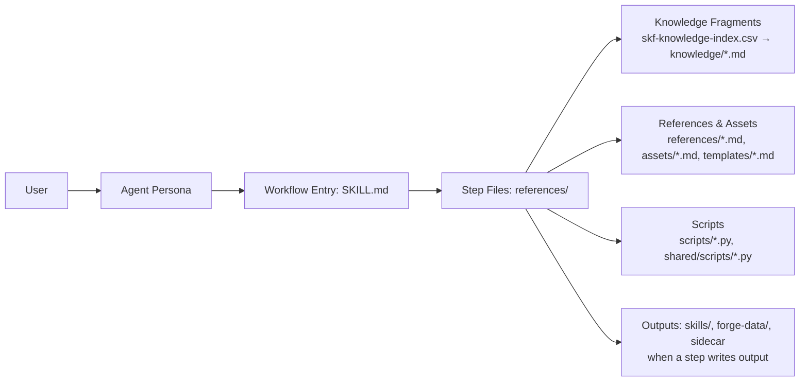

Skill Forge has no server or background service of its own. Your AI coding assistant does the work by following SKF's written instructions one step at a time. When a result must be exact, it runs SKF's Python helper scripts with `uv`. The pieces are an agent persona (Ferris), a set of workflows, a curated knowledge base, and those helper scripts. This page covers that machinery. For an end-to-end walkthrough, see [How It Works](/docs/how-it-works.md). For what a skill contains, see [Skill Model](/docs/skill-model.md).

---

## How BMAD Works

[BMAD](https://docs.bmad-method.org/) tackles complex, open-ended work by decomposing it into **repeatable workflows**. Every workflow is a sequence of small, explicit steps, so the AI takes the same route on every run. A **shared knowledge base** of standards and patterns backs those steps, keeping outputs consistent instead of improvised. The formula is simple: **structured steps + shared standards = reliable results**.

SKF plugs into BMAD the same way a specialist plugs into a team. It uses the same step-by-step workflow engine and shared standards, but focuses exclusively on skill compilation and quality assurance.

---

## Building Blocks

A workflow directory holds some or all of these files, and each has a specific job:

| File                      | What it does                                                                                                        | When it loads                                     |
|---------------------------|---------------------------------------------------------------------------------------------------------------------|---------------------------------------------------|
| `SKILL.md`                | Human-readable entry point: goals, role definition, initialization sequence, invocation contract, and the route to the first step | Entry point per workflow                          |
| `customize.toml`          | Settings a team or a person can override without editing SKF, such as facts to keep in mind for the whole run or a command to run when the workflow ends. Overrides go in `_bmad/custom/<workflow>.toml` (shared) or `_bmad/custom/<workflow>.user.toml` (personal), for example `_bmad/custom/skf-create-skill.toml`. They take effect only in a project where the BMAD Method installer has added its customization script; with SKF installed alone, the bundled settings apply | Read once, when the workflow starts |
| `references/*.md` (step files)    | The workflow's stages, one file per step. Each names the next one in its `nextStepFile` front matter, and the last one hands off to the shared health check | One at a time (just-in-time)                      |
| `references/*.md` (reference data) | Workflow-specific reference data: rules, patterns, protocols                                                       | Read by steps on demand                           |
| `assets/*.md`             | Workflow-specific output formats: schemas, templates, heuristics                                                   | Read by steps on demand                           |
| `templates/*.md`          | Output skeletons with placeholder variables. Steps fill these in to produce the final artifact                          | Read by steps when generating output              |
| `scripts/*.py`            | Deterministic Python scripts for scoring, validation, structural diffing and manifest operations                         | Invoked by steps via `uv run` for reproducible computation |

**Module-level shared files** (not per-workflow; loaded by the agent or referenced across workflows):

| File                      | What it does                                                                                                        | When it loads                                     |
|---------------------------|---------------------------------------------------------------------------------------------------------------------|---------------------------------------------------|
| `skf-forger/SKILL.md`     | Ferris's persona: identity, principles, critical actions, and the menu of workflow codes | Loaded when you talk to Ferris. A workflow you start directly, such as `/skf-setup`, runs without it |
| `knowledge/skf-knowledge-index.csv` | Knowledge fragment index with columns id, name, description, tags, tier, and fragment file path                                                          | Read by steps to decide which fragments to load   |
| `knowledge/*.md`          | 14 reusable fragments plus the overview.md index: cross-cutting principles and patterns (for example `zero-hallucination.md`, `confidence-tiers.md`, `ccc-bridge.md`) | Selectively read into context when a step directs |
| `shared/scripts/*.py`     | Cross-workflow Python scripts: preflight checks, manifest operations, managed-section rebuilds, frontmatter and output validation, severity classification, structural diffing, skill inventory, result-envelope emission, language, docs and tools detection, content hashing, and atomic writes (see [`src/shared/scripts/`](https://github.com/armelhbobdad/bmad-module-skill-forge/tree/main/src/shared/scripts)) | Invoked by any workflow that needs deterministic computation |
| `shared/health-check.md`  | The last step of every workflow. It looks back at the run and records any problems in SKF's own instructions | After the workflow's final report |
| `shared/references/*.md`  | Rules several workflows follow, such as pipeline contracts, the result-file format, headless gate handling and Tessl Review | Read by steps on demand |



## Runtime flow

1. **Trigger**: You type `@Ferris CS` (or a close match like `create-skill`). The menu in `skf-forger/SKILL.md` maps the code to the workflow's skill, here `skf-create-skill`.
2. **Agent loads**: `skf-forger/SKILL.md` puts the persona (identity, principles, critical actions) into the context window. Ferris also loads its sidecar files (`forge-tier.yaml`, `preferences.yaml`), which keep your tier and preferences between sessions.
3. **Workflow loads**: The workflow's `SKILL.md` loads your SKF settings from `_bmad/skf/config.yaml` and checks whether the run is headless (runs without asking questions). It then applies any team or personal overrides to the workflow's `customize.toml` (only when the BMAD Method's customization script is present; with SKF installed alone it keeps the bundled settings) and opens the first step file.
4. **Step-by-step execution**: Only the current step file is in context (just-in-time loading). Each step names the next one. The assistant reads the step, carries it out, saves its output, then loads the next step. Future steps are never loaded early.
5. **Sub-agent delegation**: Some steps would otherwise read many large files, such as several `SKILL.md` documents or every file that imports a library. These steps hand the reading to sub-agents, which are helper AI sessions started with the Agent tool. Each sub-agent reads its share and returns a short JSON summary. The parent never loads the full text, so the next step starts with an uncluttered context window. AN (per-unit analysis), TS (coverage and coherence checks), VS (integration verification), RA (gap analysis) and SS (per-library extraction) work this way. VS and RA run at most 8 sub-agents at a time. SS runs 3 to 5 at a time in Claude Code.
6. **Knowledge injection**: Steps consult `skf-knowledge-index.csv` and load only the fragments from `knowledge/` that match by tags and relevance. Cross-cutting principles (zero hallucination, confidence tiers, provenance) load only when a step asks for them, never in advance.
7. **Reference and asset injection**: Steps read `references/*.md` and `assets/*.md` files as needed (rules, patterns, schemas, heuristics). This is deliberate: only the data the current step needs enters the context window.
8. **Script execution**: Steps run deterministic Python scripts (`scripts/*.py`, `shared/scripts/*.py`), usually with `uv run`, for work that must be reproducible: scoring, structural diffing, manifest operations, frontmatter validation. The assistant prepares the inputs, the script computes, and the assistant uses the output. The same inputs always give the same result.
9. **Templates**: When a step produces a report (for example, an analysis report or a test report), it reads the template file and fills in the placeholders with computed results. The template gives the structure, and the step supplies the content.
10. **Progress tracking**: Most workflows run from start to finish in one session. Analyze Source records its finished steps in its report's front matter (`stepsCompleted`), so a later session can pick up where it stopped. Create Skill's `--batch` mode keeps the batch's progress in a run folder, so a batch that an ended session left goes on where it stopped when you run it again with the same briefs. Campaign keeps its progress in `_campaign-state.yaml`, so `@Ferris campaign resume` can continue it. When a chain of workflows run by Ferris stops early, Ferris offers to resume it from the chain's journal the next time you talk to him.

**Chained runs**: If you give Ferris several codes at once (for example `BS CS TS EX`) or a pipeline alias (`forge-auto`, `forge`, `forge-quick`, `maintain`), it runs those workflows one after another without stopping for questions. It passes each workflow's output to the next and halts the chain if a quality check fails. It records the chain's progress in a journal, `pipeline-journal.json`, in the chain's own run folder under `_bmad-output/.skf-run/`, after every workflow, so it can offer to resume a chain that stopped early, even after a closed session. When the chain ends, it writes the chain's result to `pipeline-result-latest.json` in its sidecar folder. See [Pipeline Mode](/docs/workflows.md#pipeline-mode).

## Ferris Operating Modes

Ferris operates in five workflow-driven modes (mode is determined by which workflow is running, not conversation state):

| Mode          | Workflows          | Behavior                                                    |
|---------------|--------------------|-------------------------------------------------------------|
| **Architect** | SF, AN, BS, CS, QS, SS, RA | Exploratory, assembling, refining. Discovers structure, scopes skills, and improves architecture |
| **Surgeon**   | US                 | Precise, semantic diffing. Preserves [MANUAL] sections during regeneration |
| **Audit**     | AS, TS, VS         | Judgmental, scoring. Evaluates quality and detects drift   |
| **Delivery**  | EX                 | Validates package, generates snippets, injects into context files |
| **Management** | RS, DS, CA        | Transactional rename and drop. Rename copies, verifies, then deletes. Drop deprecates or purges. Both rebuild the platform context files afterwards. Campaign (`@Ferris campaign`) runs other workflows in order and tracks each skill's progress |

---

## Tool Ecosystem

### 7 Tools

| Tool | Wraps | Purpose |
|------|-------|---------|
| **`gh_bridge`** | GitHub CLI (`gh`) | Source code access, issue mining, release tracking, PR intelligence |
| **`skill-check`** | [thedaviddias/skill-check](https://github.com/thedaviddias/skill-check) | Validation + auto-fix (`check --fix`), quality scoring (0-100), security scan, split-body, diff comparison |
| **`tessl`** | [tessl](https://tessl.io) (`tessl review run`) | Opt-in Tessl Review of the skill folder: validation checks and AI judges for the description and the content, with suggestions. Off unless `tessl_review_workspace` is set in preferences; needs a Tessl account |
| **`ast_bridge`** | ast-grep CLI | Structural extraction, custom AST queries, co-import detection |
| **`ccc_bridge`** | cocoindex-code | Semantic code search, project indexing, file discovery pre-ranking |
| **`qmd_bridge`** | QMD (local search) | BM25 keyword search, vector semantic search, collection indexing |
| **`doc_fetcher`** | Environment web tools | Fetches remote documentation using whatever web tool your environment has (Firecrawl, WebFetch, curl, and so on). Everything it returns is labeled T3, the lowest confidence tier, and never overrides facts read from the code. |

Bridge names are **conceptual interfaces** used throughout workflow steps. Each bridge resolves to concrete MCP tools, CLI commands, or fallback behavior depending on the IDE environment. See [`src/knowledge/tool-resolution.md`](https://github.com/armelhbobdad/bmad-module-skill-forge/blob/main/src/knowledge/tool-resolution.md) for the complete resolution table.

### Conflict Resolution

When tools disagree, the claim with the higher confidence tier wins. Lower-tier content is kept as notes around it and never replaces it.

| Priority | Source | Confidence tier | Tool |
|----------|--------|-----------------|------|
| 1 (highest) | AST extraction | T1 | `ast_bridge` |
| 2 | Source reading without AST | T1-low | `gh_bridge` or local file reads |
| 3 | QMD evidence | T2 | `qmd_bridge` |
| 4 | External documentation | T3 | `doc_fetcher` |

`ccc_bridge` is not in this order. It only suggests which files to read first. Every file or name it returns is checked by `ast_bridge` or by source reading before it can become a claim.

### Manifest Detection

Stack Skill (SS) finds a project's dependencies by looking for package manifest files, and Analyze Source (AN) runs the same scan to list a project's manifests. A shared script, [`shared/scripts/skf-scan-manifests.py`](https://github.com/armelhbobdad/bmad-module-skill-forge/blob/main/src/shared/scripts/skf-scan-manifests.py), does the scan, so every run finds the same files. It reads only runtime dependencies and skips development-only ones such as `devDependencies`:

| Ecosystem | Manifest Files |
|-----------|----------------|
| JavaScript / TypeScript | `package.json` |
| Python | `requirements.txt`, `setup.py`, `setup.cfg`, `pyproject.toml`, `Pipfile` |
| Rust | `Cargo.toml` |
| Go | `go.mod` |
| Java / Kotlin | `pom.xml`, `build.gradle`, `build.gradle.kts` |
| Ruby | `Gemfile` |
| PHP | `composer.json` |
| Swift | `Package.swift` |

The scan looks through every folder under the project root. It skips hidden folders, dependency folders (`node_modules/`, `.venv/`, `venv/`, `vendor/`, `Pods/`) and build output (`dist/`, `build/`, `out/`, `target/`, `__pycache__/`, `.next/`, `.nuxt/`, `.output/`). .NET projects (`*.csproj`) are not detected, so for those, give Stack Skill an explicit list of dependencies.

---

## Workspace Artifacts

Build artifacts are committable, so another developer can reproduce the same skill:

```
forge-data/{skill-name}/
├── skill-brief.yaml        # Compilation config (version-independent)
└── {version}/
    ├── provenance-map.json     # Source map with AST bindings
    ├── evidence-report.md      # Build audit trail
    ├── extraction-rules.yaml   # Language-specific ast-grep schema
    ├── test-report-{skill-name}-{run_id}.md   # Written by Test Skill as .skf-test-report-{skill-name}-{run_id}.md, renamed once its checks pass
    ├── test-findings-{run_id}.json            # Test Skill's gap ledger, which its hard gate reads
    ├── drift-report-{timestamp}.md            # Written by Audit Skill
    ├── .skf-audit/{timestamp}/                # The JSON each audit scored its drift from
    └── {workflow}-result-latest.json          # Machine-readable result of the last run
```

The `provenance-map.json` includes per-export `entries` with a `source_library` field naming the library each export belongs to. For stack skills, it also includes an `integrations` array (cross-library patterns) and, in compose mode only, a `constituents` array. That array records a fingerprint (hash) of each source skill's `metadata.json` at compose time, so Audit Skill can tell when a source skill has changed since. The `file_entries` array tracks copied scripts and assets file by file (SHA-256 hashes, source paths).

### Pipeline Result Contracts

Pipeline-facing workflows write a machine-readable result JSON file alongside their human-readable output. This makes CI checks and chained runs reliable: a later workflow or script can check what the earlier step produced without parsing Markdown. Each run writes two files. The first is a timestamped record, `{workflow}-result-{YYYYMMDD-HHmmss}.json`, which keeps the full history across retries and aborts. The second is a copy named `{workflow}-result-latest.json`, which other tools read without sorting through timestamps. `{workflow}` names the workflow, not the skill being built. Most workflows leave off the `skf-` prefix (`create-skill`, `update-skill`), but Test Skill keeps it. Its record is `skf-test-skill-result-{YYYYMMDD-HHmmss}.json` (UTC, with `-2` appended when a run already took that second's name), no longer named after the run ID. The files sit next to what the run produced. For Create, Update, Test and Audit Skill, that is the skill's version folder in `forge-data/`. When Ferris runs a chain of workflows, he keeps its state in a journal, `pipeline-journal.json`, in the chain's run folder under `_bmad-output/.skf-run/`, and when the chain ends he writes its result from that journal: `pipeline-result-<YYYYMMDD-HHmmss>.json` and its `pipeline-result-latest.json` copy in his sidecar folder. The schema follows a consistent format: `skill`, `status` (success/failed/partial), `timestamp`, `outputs` (array of produced artifacts with type and path), and a skill-specific `summary` object.

`skills/` and `forge-data/` are committed. Agent memory (`_bmad/_memory/forger-sidecar/`) is gitignored.

---

## Knowledge Base

SKF relies on a curated skill compilation knowledge base:

- Index: [`src/knowledge/skf-knowledge-index.csv`](https://github.com/armelhbobdad/bmad-module-skill-forge/blob/main/src/knowledge/skf-knowledge-index.csv)
- Fragments: [`src/knowledge/`](https://github.com/armelhbobdad/bmad-module-skill-forge/tree/main/src/knowledge)

Workflows load only the fragments required for the current task to stay focused and compliant.

---

## Module Structure

```
src/
├── skf-forger/               # Agent skill (SKILL.md + manifest)
├── skf-setup/                # Setup skill (forge initialization)
├── skf-analyze-source/
├── skf-brief-skill/
├── skf-create-skill/
├── skf-quick-skill/
├── skf-create-stack-skill/
├── skf-verify-stack/
├── skf-refine-architecture/
├── skf-update-skill/
├── skf-audit-skill/
├── skf-test-skill/
├── skf-export-skill/
├── skf-rename-skill/
├── skf-drop-skill/
├── skf-campaign/             # Multi-skill campaign orchestration (15th workflow)
├── forger/
│   ├── forge-tier.yaml
│   ├── preferences.yaml
│   └── README.md
├── knowledge/
│   ├── skf-knowledge-index.csv
│   └── *.md (14 knowledge fragments + overview.md index)
├── shared/                   # Cross-workflow resources
├── module.yaml               # Module metadata (code, name, config vars)
└── module-help.csv           # Skill menu for bmad-help integration
```

The installer copies the workflow folders (`skf-*/`), `knowledge/`, `shared/`, `module.yaml` and `module-help.csv` into `_bmad/skf/` in your project. It also copies the workflows, `knowledge/` and `shared/` into the skills folder of each IDE you pick. It copies the `forger/` YAML templates into `_bmad/_memory/forger-sidecar/`, where Ferris keeps your tier and preferences, and never overwrites files already there. Paths on this page such as `knowledge/` or `shared/scripts/` are relative to `_bmad/skf/`.

---

## Security

- SKF's Python helper scripts start other programs with a list of arguments, never a shell command string, so a name or path cannot slip in extra commands. Some steps have the assistant run shell commands itself. The GitHub search for a function's history, for example, first strips every character except letters, digits and underscores from the function names it inserts.
- Input sanitization: allowlist characters for repo names, file paths, patterns
- File paths validated against project root (no directory traversal)
- **Source code never leaves the machine.** All processing is local (AST, QMD, validation). The one exception is opt-in: with `tessl_review_workspace` set in preferences, create-skill and test-skill send the compiled skill (its `SKILL.md`, `references/`, `scripts/` and `assets/`, which can hold copies of source files) to Tessl Review, and each review stays in that Tessl workspace's history.
- The health check at the end of each workflow can report problems in SKF's own instructions as GitHub issues on the SKF repository. Nothing is filed until you review and confirm it. Headless runs save their findings in `forge-data/improvement-queue/` instead.
- `doc_fetcher` informs users which URLs will be fetched externally before processing

---

## Ecosystem Alignment

SKF produces skills compatible with the [agentskills.io](https://agentskills.io) ecosystem:

- Full [specification](https://agentskills.io/specification) compliance
- Distribution via [`npx skills add/publish`](https://www.npmjs.com/package/skills)
- Compatible with [agentskills/agentskills](https://github.com/agentskills/agentskills) and [vercel-labs/skills](https://github.com/vercel-labs/skills)

---

## Appendix: Key Design Decisions

| Decision | Rationale |
|----------|-----------|
| **Solo agent (Ferris), not multi-agent** | One domain (skill compilation) doesn't benefit from handoffs. Shared knowledge base (AST patterns, provenance maps) is the core asset. |
| **Workflows drive modes, not conversation** | Ferris doesn't auto-switch based on question content. Invoke a workflow to change mode. Predictable behavior. |
| **Hub-and-spoke cross-knowledge** | Each skill covers one source repository. Stack skills compose cross-library integration patterns in `references/integrations/`, citing each library's own skill. |
| **Stack skill = compositional** | SKILL.md is the integration layer. `references/` holds one file per library plus one file per integration pair (in `references/integrations/`). When a dependency changes, run Stack Skill (SS) again to rebuild the whole stack skill. Update Skill (US) does not update stack skills. |
| **New snippets reach context files only at export** | Create and update write a draft `context-snippet.md` next to the skill in `skills/`. Export regenerates the final `context-snippet.md` and writes it into the managed section of each platform context file (CLAUDE.md, AGENTS.md, .cursorrules). Create, quick, stack and update never touch that section. Rename and drop only rebuild it from skills that were already exported. |
| **Bundle spec, version-pin at release** | Offline-capable. SKF ships with a vendored agentskills.io spec pinned at release time; spec drift is a maintainer concern handled at SKF release, not a runtime concern for users. |
