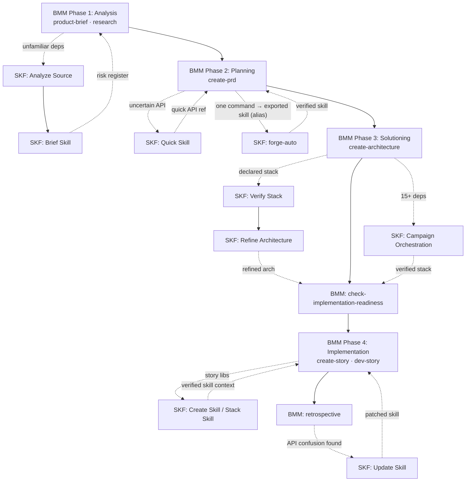
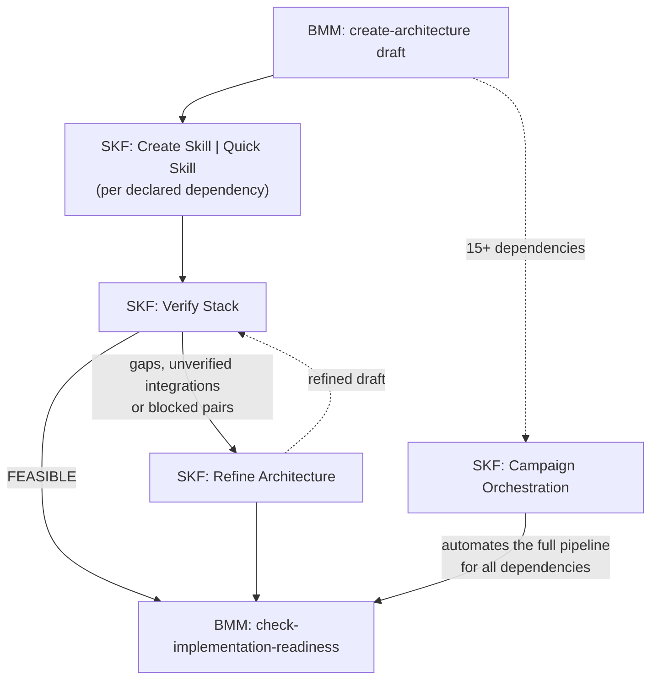
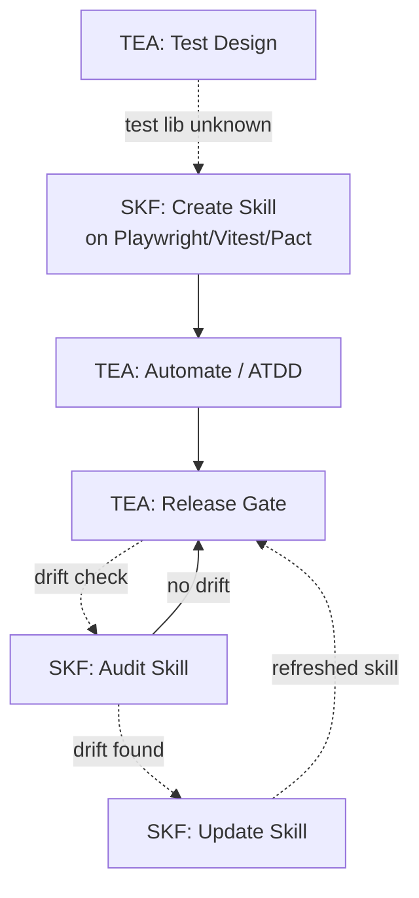

This page builds on BMAD concepts: BMM (the BMAD Method module, which takes a project through planning and build phases), TEA (the Test Architect module), and BMAD's other optional modules. New to BMAD? Start with the [BMAD docs](https://docs.bmad-method.org/) first. New to SKF? Read [Getting Started](/docs/getting-started.md) instead.

---

## Launcher Skills vs Content Skills

A BMAD project that also uses SKF ends up with two different kinds of `SKILL.md` files living in the same IDE skills directory. SKF supports 23 IDEs, each with its own skills directory: Claude Code (`.claude/skills/`), Cursor (`.cursor/skills/`), GitHub Copilot (`.github/skills/`), Windsurf (`.windsurf/skills/`), Cline (`.cline/skills/`), Roo Code (`.roo/skills/`), Gemini CLI (`.gemini/skills/`), and 16 others. See the [complete IDE → Context File mapping](https://github.com/armelhbobdad/bmad-module-skill-forge/blob/main/src/skf-export-skill/assets/managed-section-format.md) for the full list. The two kinds look similar. They are not the same thing. This is the single most durable point of confusion, so get it straight up front.

| | BMAD launcher skill | SKF content skill |
|---|---|---|
| **Created by** | `npx bmad-method install` (when you pick a module) | `@Ferris CS` / `QS` / `SS` |
| **File contains** | A thin wrapper that loads a BMAD workflow, agent, or task | The instructions themselves, with citations to real source code |
| **Updates when** | You reinstall or upgrade BMAD | You run `@Ferris US` after the upstream source changes |
| **Provenance** | Points to a BMAD workflow file inside `_bmad/` | Points to upstream repo commits, files, and line ranges |
| **Example** | `bmad-create-prd/SKILL.md` loads a PRD workflow | `skills/hono/4.6.0/hono/SKILL.md` contains verified Hono API signatures |

> BMAD skills *launch workflows*. SKF skills *are the workflows' output, frozen with citations*. Both coexist in the same IDE skills directory on purpose.

When a BMAD agent runs a workflow, that workflow can consult SKF content skills for verified API knowledge. The two kinds of skills work together; they don't compete.

---

## SKF Without BMM

SKF works standalone, with no BMAD installation required. If you found this page from a search and don't use the BMAD Method, this section is for you.

The fastest way to start is [`forge-auto`](/docs/forge-auto.md). One command produces a verified skill in 3–5 minutes with zero configuration:

```
@Ferris forge-auto https://github.com/honojs/hono
```

That's it. No brief file, no scope decisions, no multi-step pipeline to learn. forge-auto handles analysis, scoping, compilation, testing, and export automatically. The test aims for a 90% score; a skill that scores at least 80% but under 90% still passes, with an evidence report of what fell short, and below 80% the pipeline stops. See the [forge-auto guide](/docs/forge-auto.md) for the full syntax and input types.

If you later adopt the BMAD Method, the skills you created with forge-auto carry straight into BMM phases. They become the verified content skills that BMAD workflows consult during planning and implementation. The [phase-by-phase playbook](#skf-and-bmm-phase-by-phase-playbook) below shows exactly where each SKF workflow fits.

---

## SKF and BMM: Phase-by-Phase Playbook

BMM is BMAD's core [4-phase workflow](https://docs.bmad-method.org/) (Analysis → Planning → Solutioning → Implementation). SKF has five concrete entry points across those phases. The diagram below shows the end-to-end picture; the subsections that follow give the trigger, command, and artifact flow for each phase.

> **Atomic workflows vs one-command runs.** The playbook below maps each phase to an *atomic* SKF workflow (`AN`, `BS`, `QS`, `VS`, `CS`…) on purpose. In BMM you often want only part of the chain (a brief to feed a risk register, a quick reference for acceptance criteria). When you instead want the *finished, exported skill* in one command, use the [`forge-auto`](/docs/forge-auto.md) pipeline alias, which chains `AN → BS → CS → TS → EX` for a single library. For many dependencies, use the [`campaign`](/docs/campaign.md) workflow, which builds a skill for each library and then checks the whole stack. Rule of thumb: **atomic when you want a stage's artifact; forge-auto or campaign when you want the verified skill.**



### Phase 1: Analysis

**Trigger:** A brownfield repo (an existing codebase) or an unfamiliar third-party dependency surfaces during `product-brief` or `research`. The team can't answer "what does this library actually expose?" from training data.

**SKF command:** `@Ferris AN` on the repo, then `@Ferris BS` to scope each priority library.

**What flows back:** Recommended skill boundaries, an analysis report of the discovered units, and one skill-brief per library that's ready to compile later. The scoping data is what PMs typically feed into their own risk register.

**Why now, not later:** Catching surprise libraries during Analysis keeps the PRD honest. Discovering the same unknowns during Implementation forces course corrections that a two-paragraph risk entry could have prevented.

### Phase 2: Planning

**Trigger:** The PRD draft references an API and you realize nobody on the team is 100% sure how it behaves.

**SKF command:** `@Ferris QS <package>`. No brief needed.

**What flows back:** A best-effort skill built from the library's own source and README that lists its real exports, so PM and architect read the same source. It has no receipt on each instruction. When the acceptance criteria need one, use forge-auto as described below.

**Why now, not later:** Quick Skill is cheap insurance. It takes under a minute and prevents a whole class of "actually that function doesn't exist" moments during story writing.

**Want more than a quick reference?** When the PRD leans heavily on one library and you'd rather have a thorough skill (one that also draws on the library's documentation and is tested against a 90% target) than a fast QS pass, run [`@Ferris forge-auto <repo>`](/docs/forge-auto.md) instead. One command produces the finished, exported skill (auto-scope, auto-brief, compile, test, export), ready for BMM workflows to consult.

### Phase 3: Solutioning

This is the highest-value integration. BMM's architect agent works from assumptions about the declared stack; SKF is how those assumptions become evidence-backed before the team commits to an implementation readiness check.

**Trigger:** Architecture draft exists, `check-implementation-readiness` hasn't run yet.

**SKF commands:** `@Ferris QS <library>` per declared dependency, then `@Ferris VS`, then `@Ferris RA` on any gaps or failures. Once the architecture holds, `@Ferris SS` can compose a stack skill from those skills and the refined architecture, before any code exists.

**What flows back:** A feasibility report that gives each pair of libraries a verdict (Verified, Plausible, Risky, or Blocked) and the whole stack an overall verdict (FEASIBLE, CONDITIONALLY_FEASIBLE, or NOT_FEASIBLE), with evidence from the skills behind every verdict. A pair is Verified only when one of its two skills cites the other, and FEASIBLE needs every pair verified. VS takes the pairs from a stack skill's `integration_patterns` when one is in the inventory, and otherwise from your document's prose, never from a Mermaid diagram. When it finds no pair between two or more covered technologies (they appear only in a diagram, say), the verdict is CONDITIONALLY_FEASIBLE, with a recommendation to describe them in prose: nothing was verified. Even with no coverage at all, or every pair Blocked, VS finishes its report, with NOT_FEASIBLE and a recommendation for each gap. RA then writes a refined copy of your architecture document that fills gaps, flags issues, and suggests improvements, each backed by API evidence from the skills. Your original document is left unchanged.

**Why now, not later:** Running VS after Implementation has started means your stories are already built on an unverified foundation. The loop below is designed to iterate cheaply *before* code gets written.



The Pre-Code Architecture Verification scenario in [Examples](/docs/examples.md) walks through a concrete case of this loop.

#### Campaign Orchestration

**Trigger:** The architecture declares 15+ dependencies, too many to run through the pipeline one library at a time.

**SKF command:** `@Ferris campaign`

**What flows back:** All declared dependencies are skilled in dependency order, verified for cross-skill consistency, and exported as a cohesive set. A campaign report summarizes per-skill quality scores and the overall outcome.

**Why now, not later:** Campaign does at scale what you would otherwise run by hand: a skill for each library, then SS, VS, and RA for the stack as a whole. Running it during Solutioning means the entire stack is verified before implementation begins, so no surprise API gaps turn up mid-sprint.

### Phase 4: Implementation

Two distinct triggers fire during Implementation, one at the start of each story and one after each retrospective.

**Trigger A (before `create-story`):** The story touches a library whose API isn't already in a content skill.

**SKF command:** `@Ferris CS` for a single library, or `@Ferris SS` when the story spans several dependencies. If there's no brief yet and you want the skill in one shot, [`@Ferris forge-auto <repo>`](/docs/forge-auto.md) runs the full analyze → brief → compile → test → export chain from just the repo URL.

**What flows back:** A verified content skill the `dev-story` workflow can consult during implementation, so no one guesses function signatures from training data. After `CS` or `SS`, run `@Ferris TS` and then `@Ferris EX` before the story starts. Until EX runs, the skill is a draft that your agent's context files don't list. (forge-auto already includes both steps.)

**Trigger B (after `retrospective`):** The retro flagged something like "we kept getting API X wrong this sprint."

**SKF command:** `@Ferris US` on the affected skill when the library's source has changed since the skill was built. If the source hasn't changed and the skill just lacks the edge case, add it to a `[MANUAL]` section of the skill yourself, or run `@Ferris TS` and then `@Ferris US --from-test-report` to repair the gaps the test found.

**What flows back:** A patched skill. US keeps every `[MANUAL]` section, so human annotations aren't overwritten. Run `@Ferris TS` and `@Ferris EX` on it so next sprint's stories pick up the new version.

[Scenario A in Examples](/docs/examples.md#scenario-a-greenfield--bmm-integration) shows the companion habit: after a retrospective, the team briefs and builds new skills (`BS`, `CS`, `TS`, `EX`), so coverage grows each sprint. Both loops pay off in any BMM project that runs more than a few sprints.

---

## SKF with Optional BMAD Modules

BMAD ships several [optional modules](https://github.com/orgs/bmad-code-org/repositories). Synergy with SKF ranges from very high (TEA) to narrow (CIS). This section is honest about both.

### TEA: Test Architect

TEA produces structured test strategies and release gates. SKF produces the verified skills TEA's workflows need when the test target is a library they don't fully know.



Two concrete integrations:

- **Before Test Design / ATDD / Automate / Framework Scaffolding:** build a skill for whichever test library the strategy depends on (Playwright, Vitest, Pact, etc.), either with `@Ferris BS` and then `@Ferris CS`, or in one command with `@Ferris forge-auto <repo>`. TEA's test-authoring agents then work against verified API surfaces instead of training-data approximations.
- **Before Release Gate:** run `@Ferris AS` on the skills the gate cites. If a skill has drifted from the current source, the drift report itself becomes evidence the gate can act on. Then `@Ferris US`, `@Ferris TS`, and `@Ferris EX` close the loop; the `maintain` pipeline alias runs audit, update, test, and export in one command.

### BMB: BMAD Builder

BMB authors extend BMAD with new agents, workflows, or entire modules. SKF itself was built using BMB, so it is a working example of the BMAD module architecture. When a new module depends on third-party libraries, ship a verified companion skill alongside it:

- During `module-builder`, run `@Ferris SS` on the module's declared stack. The resulting stack skill becomes part of the module's distribution, so downstream users get both the BMAD module BMB built and the SKF content skill you compiled as its companion in a single install.

### GDS: Game Dev Studio

Narrow synergy. GDS covers GDD authoring, narrative design, and engine-specific guidance for 21+ game types, and most of that is conceptual work with no code to verify. The exception is when the GDD commits to a concrete engine SDK (Bevy, Godot-Rust, Unity DOTS):

- Once the engine binding is pinned, build a skill for it (`@Ferris BS` then `@Ferris CS`, or `@Ferris forge-auto <repo>` in one command). The implementation team then has verified bindings to work against.

For narrative, character design, world-building, or genre research, there is no synergy. SKF has nothing to offer the creative side of GDS.

### CIS: Creative Intelligence Suite

Narrow but real synergy during Brief Skill (`@Ferris BS`). CIS's brainstorming coach can sharpen scope decisions before compilation begins, especially when briefing a skill for a library you don't know well, or when stakeholders disagree on what the skill should cover. Two related tools come from BMAD Core, not CIS: Advanced Elicitation and Party Mode. Brief Skill's scope and confirmation menus offer them as `[A]` and `[P]`, and so does Analyze Source's recommendation menu. The [oh-my-skills](https://github.com/armelhbobdad/oh-my-skills) repository uses BMAD Core + CIS alongside SKF: when briefing [`oms-storybook-react-vite`](https://github.com/armelhbobdad/oh-my-skills/blob/main/forge-data/oms-storybook-react-vite/skill-brief.yaml), CIS brainstorming plus Core's party mode and advanced elicitation helped narrow a massive repo (Storybook supports Next.js, Astro, SvelteKit, and more, with extensive documentation for each) down to an accurate brief scoped specifically to React + Vite.

Beyond briefing, CIS and SKF don't overlap. CIS covers ideation, storytelling, and innovation strategy, where there's no code to verify. Use CIS for the creative and strategic work, then bring SKF in once you're producing concrete technical artifacts.

---

## Delivery and Lifecycle in a BMAD Project

`@Ferris EX` is the **only workflow that introduces new skill context** into the three context files that serve all 23 IDEs: `CLAUDE.md` (Claude Code), `.cursorrules` (Cursor), and `AGENTS.md` (the remaining 21 IDEs, including GitHub Copilot, Windsurf, Cline, Roo Code, and Gemini CLI). The IDE loads its context file into every session, so what EX writes there is the agent's passive context. Each IDE also has its own skill root directory where skill files are installed (e.g., `.windsurf/skills/`, `.roo/skills/`, `.gemini/skills/`). Create-skill and update-skill produce draft artifacts that never touch those files directly, so nothing reaches an agent's passive context until it has been through the EX gate. See [Skill Model → Dual-Output Strategy](/docs/skill-model.md#dual-output-strategy) for the architectural rationale.

This matters specifically in a BMAD project: you may have multiple BMAD modules, each with its own launcher skills, plus SKF content skills, all trying to contribute context. Only skills you explicitly export reach an agent's passive context. EX refuses a skill whose package fails its structure checks, but a missing or failing test report only earns a warning, so run `@Ferris TS` before `@Ferris EX`. EX writes only between its `SKF:BEGIN` and `SKF:END` markers and leaves the rest of each file alone, so its section coexists cleanly with whatever BMAD's installer wrote in the same files.

The pipelines (`forge`, `forge-auto`, `forge-quick`, `maintain`) are stricter than a standalone `@Ferris EX`: they stop before export when Test Skill fails. To keep untested skills out of shared context files, export through a pipeline, or run `@Ferris TS` first and export only when it passes.

For long-running BMAD projects, `@Ferris RS` (rename) and `@Ferris DS` (drop) keep the skill inventory clean as libraries get swapped, versions get deprecated, or naming conventions evolve across sprints. Both *rebuild* the existing managed sections in those context files so references stay consistent after a rename or drop. They never add content that was not already exported, so EX still governs what first enters those files.

---

## Where to Go Next

- [BMAD docs](https://docs.bmad-method.org/): canonical reference for BMM phases, TEA workflows, BMB / GDS / CIS details, and the full module list
- [Forge-Auto](/docs/forge-auto.md): the one-command alias that runs analyze → brief → compile → test → export for a single library
- [Campaign](/docs/campaign.md): orchestrate the full pipeline across many dependencies with dependency ordering and resume
- [Workflows](/docs/workflows.md): complete SKF workflow reference with commands and connection diagrams
- [Examples](/docs/examples.md): concrete scenarios including the BMM retrospective loop and greenfield architecture verification
