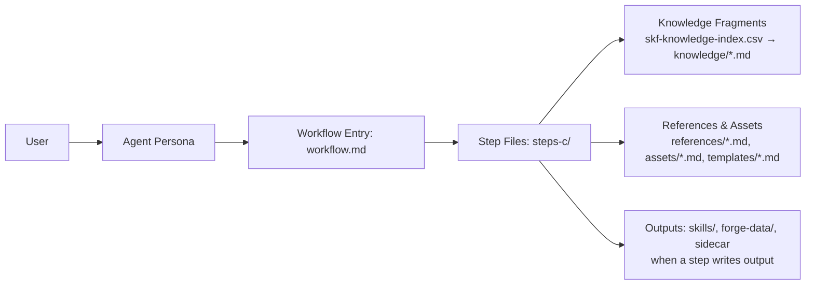

# How It Works

This page is for people who want to understand how SKF works under the hood. It covers the BMad framework, workflow architecture, capability tiers, output format, tool ecosystem, and key design decisions. For definitions of key terms, see [Concepts](../concepts/).

---

## How BMad Works

[BMad](https://docs.bmad-method.org/) works because it turns big, fuzzy work into **repeatable workflows**. Each workflow is broken into small steps with clear instructions, so the AI follows the same path every time. It also uses a **shared knowledge base** (standards and patterns) so outputs are consistent, not random. In short: **structured steps + shared standards = reliable results**.

## How SKF Fits In

SKF plugs into BMad the same way a specialist plugs into a team. It uses the same step-by-step workflow engine and shared standards, but focuses exclusively on skill compilation and quality assurance. That means you get **evidence-based agent skills**, **AST-verified instructions**, and **drift detection** that align with the rest of the BMad process.

---

## Architecture & Flow

BMad is a small **agent + workflow engine**. There is no external orchestrator — everything runs inside the LLM context window through structured instructions.

### Building Blocks

Each workflow directory contains these files, and each has a specific job:

| File                      | What it does                                                                                                        | When it loads                                     |
|---------------------------|---------------------------------------------------------------------------------------------------------------------|---------------------------------------------------|
| `workflow.md`             | Human-readable entry point — goals, role definition, initialization sequence, routes to first step                   | Entry point per workflow                          |
| `steps-c/*.md`            | **Create** steps — primary execution, 5–11 sequential files per workflow                                            | One at a time (just-in-time)                      |
| `references/*.md`         | Workflow-specific reference data — rules, patterns, protocols                                                       | Read by steps on demand                           |
| `assets/*.md`             | Workflow-specific output formats — schemas, templates, heuristics                                                   | Read by steps on demand                           |
| `templates/*.md`          | Output skeletons with placeholder vars — steps fill these in to produce the final artifact                          | Read by steps when generating output              |

**Module-level shared files** (not per-workflow — loaded by the agent or referenced across workflows):

| File                      | What it does                                                                                                        | When it loads                                     |
|---------------------------|---------------------------------------------------------------------------------------------------------------------|---------------------------------------------------|
| `skf-forger/SKILL.md`     | Expert persona — identity, principles, critical actions, menu of triggers                                           | First — always in context                         |
| `knowledge/skf-knowledge-index.csv` | Knowledge fragment index — id, name, tags, tier, file path                                                          | Read by steps to decide which fragments to load   |
| `knowledge/*.md`          | 14 reusable fragments + overview.md index — cross-cutting principles and patterns (e.g., `zero-hallucination.md`, `confidence-tiers.md`, `ccc-bridge.md`) | Selectively read into context when a step directs |



### How It Works at Runtime

1. **Trigger** — User types `@Ferris CS` (or fuzzy match like `create-skill`). The agent menu in `skf-forger/SKILL.md` maps the trigger to the workflow path.
2. **Agent loads** — `skf-forger/SKILL.md` injects the persona (identity, principles, critical actions) into the context window. Sidecar files (`forge-tier.yaml`, `preferences.yaml`) are loaded for persistent state.
3. **Workflow loads** — `workflow.md` presents the mode choice and routes to the first step file.
4. **Step-by-step execution** — Only the current step file is in context (just-in-time loading). Each step explicitly names the next one. The LLM reads, executes, saves output, then loads the next step. No future steps are ever preloaded.
5. **Knowledge injection** — Steps consult `skf-knowledge-index.csv` and selectively load fragments from `knowledge/` by tags and relevance. Cross-cutting principles (zero hallucination, confidence tiers, provenance) are loaded only when a step directs — not preloaded.
6. **Reference and asset injection** — Steps read `references/*.md` and `assets/*.md` files as needed (rules, patterns, schemas, heuristics). This is deliberate context engineering: only the data relevant to the current step enters the context window.
7. **Templates** — When a step produces output (e.g., a skill brief or test report), it reads the template file and fills in placeholders with computed results. The template provides consistent structure; the step provides the content.
8. **Progress tracking** — Each step appends to an output file with state tracking. Resume mode reads this state and routes to the next incomplete step.

### Ferris Operating Modes

Ferris operates in five workflow-driven modes (mode is determined by which workflow is running, not conversation state):

| Mode          | Workflows          | Behavior                                                    |
|---------------|--------------------|-------------------------------------------------------------|
| **Architect** | SF, AN, BS, CS, QS, SS, RA | Exploratory, assembling, refining — discovers structure, scopes skills, and improves architecture |
| **Surgeon**   | US                 | Precise, semantic diffing — preserves [MANUAL] sections during regeneration |
| **Audit**     | AS, TS, VS         | Judgmental, scoring — evaluates quality and detects drift   |
| **Delivery**  | EX                 | Validates package, generates snippets, injects into context files |
| **Management** | RS, DS            | Transactional rename/drop — copy-verify-delete with platform context rebuild |

---

## Why Another Tool?

AI agents guess API calls from training data. When the training data is wrong, outdated, or incomplete, they hallucinate — inventing function names, guessing parameter types, producing code that fails at runtime.

Several approaches exist to address this, but each has a gap:

| Approach | What it does well | Where it falls short |
|----------|-------------------|----------------------|
| Skill scaffolding (`npx skills init`) | Generates a spec-compliant skill file | The file is empty — you still have to write every instruction by hand |
| LLM summarization | Understands context and intent | Generates plausible-sounding content that may not match the actual API |
| RAG / context stuffing | Retrieves relevant code snippets | Returns fragments without synthesis — no coherent skill output |
| Manual authoring | High initial accuracy | Drifts as the source code changes, doesn't scale across dependencies |
| IDE built-in context (Copilot, Cursor) | Convenient, zero setup | Uses generic training data, not your project's specific integration patterns |

SKF takes a different approach: it mechanically extracts function signatures, type definitions, and usage patterns from source code via AST parsing, enriches them with documentation and developer discourse, then compiles everything into version-pinned skills that comply with the [agentskills.io specification](https://agentskills.io/specification). Every instruction traces to its source — nothing is generated from training data.

---

## Progressive Capability Model

SKF uses an additive tier model. You never lose capability by adding a tool.

| Tier | Required Tools | What You Get |
|------|---------------|-------------|
| **Quick** | None (`gh_bridge`, `skill-check`, `tessl` used when available) | Source reading + spec validation + content quality review. Best-effort skills in under a minute. **Note:** Quick Skill (QS) is tier-unaware by design — it always runs at community tier regardless of installed tools. |
| **Forge** | + `ast_bridge` (ast-grep) | Structural truth. AST-verified signatures. Co-import detection. T1 confidence. |
| **Forge+** | + `ccc_bridge` (cocoindex-code) | Semantic discovery. CCC pre-ranks files by meaning before AST extraction. Better coverage on large codebases. |
| **Deep** | `ast_bridge` + `gh_bridge` (gh) + `qmd_bridge` (QMD). CCC optional — enhances when installed. | Knowledge search. Temporal provenance. Drift detection. Full intelligence. |

Setup detects your installed tools and sets your tier automatically:

```
@Ferris SF
```

```
Forge initialized. Tools: gh, ast-grep, ccc, QMD. Tier: Deep. Ready.
```

Don't have ast-grep, cocoindex-code, or QMD yet? No problem — Quick mode works with no additional tools. Optional GitHub CLI improves source access. Install tools later; your tier upgrades automatically.

### Tier Override — Comparing Output Across Tiers

You can force a specific tier by setting `tier_override` in your preferences file (`_bmad/_memory/forger-sidecar/preferences.yaml`):

```yaml
# Force Forge tier regardless of detected tools
tier_override: Forge
```

This is useful for comparing skill quality across tiers for the same target:

```
# 1. Set tier_override: Quick in preferences.yaml
@Ferris CS                # compile at Quick tier

# 2. Change to tier_override: Forge
@Ferris CS                # recompile at Forge tier — compare output

# 3. Change to tier_override: Forge+
@Ferris CS                # recompile with semantic discovery — compare coverage

# 4. Reset to tier_override: ~ (auto-detect)
```

Set `tier_override` to `Quick`, `Forge`, `Forge+`, or `Deep`. Set to `~` (null) to return to auto-detection. The override is respected by all tier-aware workflows (CS, SS, US, AS, TS).

---

## Confidence Tiers

Every claim in a generated skill carries a confidence tier that traces to its source:

| Tier | Source | Tool | What It Means |
|------|--------|------|---------------|
| **T1** | AST extraction | `ast_bridge` | Current code, structurally verified. Immutable for that version. |
| **T1-low** | Source reading | `gh_bridge` | Source-read without AST verification. Location correct, signature may be inferred. |
| **T2** | QMD evidence | `qmd_bridge` | Historical + planned context (issues, PRs, changelogs, docs). |
| **T3** | External documentation | `doc_fetcher` | External, untrusted. Quarantined. |

### Temporal Provenance

Confidence tiers map to temporal scopes:

- **T1-now (instructions):** What ast-grep sees in the checked-out code. This is what your agent executes.
- **T2-past (annotations):** Closed issues, merged PRs, changelogs — why the API looks the way it does.
- **T2-future (annotations):** Open PRs, deprecation warnings, RFCs — what's coming.

Progressive disclosure controls how much context surfaces at each level:

| Output | Content |
|--------|---------|
| `context-snippet.md` | T1-now + T2-future gotchas (breaking changes, deprecation warnings) — compressed, always-on |
| `SKILL.md` | T1-now + lightweight T2 annotations |
| `references/` | Full temporal context with all tiers |

### Tier Constrains Authority

Your forge tier limits what authority claims a skill can make:

| Forge Tier | AST? | CCC? | QMD? | Max Authority | Accuracy Guarantee |
|-----------|------|------|------|---------------|-------------------|
| Quick | No | No | No | `community` | Best-effort |
| Forge | Yes | No | No | `official` | Structural (AST-verified) |
| Forge+ | Yes | Yes | No | `official` | Structural + semantic discovery |
| Deep | Yes | opt. (enhances when installed) | Yes | `official` | Full (structural + contextual + temporal) |

---

## Completeness Scoring

The Test Skill workflow (`@Ferris TS`) calculates a **completeness score** — a weighted measure of how thoroughly and accurately a skill documents its target. This score is the quality gate: pass and the skill is ready for export; fail and it routes to update-skill for remediation.

### Categories & Weights

The score is the weighted sum of five categories:

| Category | Weight | What It Measures |
|----------|--------|------------------|
| **Export Coverage** | 36% | Percentage of source exports documented in SKILL.md |
| **Signature Accuracy** | 22% | Documented function signatures match actual source signatures (parameter names, types, order, return types) |
| **Type Coverage** | 14% | Types and interfaces referenced in exports are fully documented |
| **Coherence** | 18% | Cross-references resolve, integration patterns are complete (contextual mode only) |
| **External Validation** | 10% | Average of skill-check quality score (0-100) and tessl content score (0-100%) |

### Formula

```
total_score = sum(category_weight × category_score)
```

Each category score is a percentage: `(items_passing / items_total) × 100`.

**Coherence** (contextual mode) combines two sub-scores:

```
coherence = (reference_validity × 0.6) + (integration_completeness × 0.4)
```

If no integration patterns exist, coherence equals reference validity alone.

**External validation** averages the two tools when both are available. When only one tool is available, that tool's score is used. When neither is available, the 10% weight is redistributed proportionally to the other active categories.

### Deterministic Scoring

The weight redistribution and score aggregation are computed by a deterministic Node.js script ([`compute-score.js`](https://github.com/armelhbobdad/bmad-module-skill-forge/blob/main/src/skf-test-skill/scripts/compute-score.js)). The LLM extracts category scores from the test report, constructs a JSON input, invokes the script, and uses its output for the final score. This ensures reproducible results — the same inputs always produce the same score. If the script is unavailable, the LLM falls back to manual calculation using the same formulas.

### Naive vs Contextual Mode

Test Skill runs in one of two modes, detected automatically:

- **Contextual mode** (stack skills) — All five categories scored with the default weights above.
- **Naive mode** (individual skills) — Coherence is not scored. Its 18% weight is redistributed:

| Category | Naive Weight |
|----------|-------------|
| Export Coverage | 45% |
| Signature Accuracy | 25% |
| Type Coverage | 20% |
| External Validation | 10% |

### Tier Adjustments

Your forge tier determines which categories can be scored:

| Tier | Skipped Categories | Reason |
|------|-------------------|--------|
| **Quick** | Signature Accuracy, Type Coverage | No AST parsing available |
| **Docs-only** | Signature Accuracy, Type Coverage | No source code to compare against |
| **Provenance-map** (State 2) | Signature Accuracy, Type Coverage | String comparison only, no semantic AST verification |
| **Forge / Forge+ / Deep** | None | Full AST-backed scoring |

When categories are skipped, their combined weight (36%) is redistributed proportionally to the remaining active categories. A Quick-tier skill and a Deep-tier skill both pass at the same 80% threshold — the score reflects what your tier can actually measure.

### Pass/Fail

```
threshold = custom_threshold OR 80% (default)

score >= threshold  →  PASS  →  Recommend export-skill
score <  threshold  →  FAIL  →  Recommend update-skill
```

The default is 80%. You can override it by specifying a custom threshold when invoking the workflow (e.g., "test this skill with a 70% threshold").

### Gap Severities

When the score is calculated, each finding is classified by severity to guide remediation:

| Severity | Examples |
|----------|----------|
| **Critical** | Missing exported function/class documentation |
| **High** | Signature mismatch between source and SKILL.md |
| **Medium** | Missing type/interface documentation; scripts/assets directory inconsistencies |
| **Low** | Missing optional metadata or examples; description optimization opportunities |
| **Info** | Style suggestions; discovery testing recommendations |

### Score Report Output

The test report includes a score breakdown table showing each category's raw score, weight, and weighted contribution:

| Category | Score | Weight | Weighted |
|----------|-------|--------|----------|
| Export Coverage | 92% | 36% | 33.1% |
| Signature Accuracy | 85% | 22% | 18.7% |
| Type Coverage | 100% | 14% | 14.0% |
| Coherence | 80% | 18% | 14.4% |
| External Validation | 78% | 10% | 7.8% |
| **Total** | | **100%** | **88.0%** |

The report also records `analysisConfidence` (full, provenance-map, metadata-only, remote-only, or docs-only) and includes a degradation notice when source access was limited.

---

## Output Architecture

### Per-Skill Output

Every generated skill produces a self-contained, version-aware directory:

```
skills/{name}/
├── active -> {version}           # Symlink to current version
├── {version}/
│   └── {name}/                   # agentskills.io-compliant package
│       ├── SKILL.md              # Active skill (loaded on trigger)
│       ├── context-snippet.md    # Passive context (compressed, always-on)
│       ├── metadata.json         # Machine-readable provenance
│       ├── references/           # Progressive disclosure
│       │   ├── {function-a}.md
│       │   └── {function-b}.md
│       ├── scripts/              # Executable automation (when detected in source)
│       │   └── {script-name}.sh
│       └── assets/               # Templates, schemas, configs (when detected in source)
│           └── {asset-name}.json
└── {older-version}/
    └── {name}/                   # Previous version preserved
        └── ...
```

Multiple versions coexist under the same skill name. The `active` symlink points to the current version. Updating a skill for a new library release creates a new version directory — users pinned to older versions keep their skill intact. The inner `{name}/` directory is a standalone [agentskills.io](https://agentskills.io) package, directly installable via `npx skills add`.

The `scripts/` and `assets/` directories are optional — only created when the source repository contains executable scripts or static assets matching detection heuristics. Each file traces to its source via `[SRC:file:L1]` provenance citations with SHA-256 content hashes for drift detection. User-authored files go in `scripts/[MANUAL]/` or `assets/[MANUAL]/` subdirectories and are preserved during updates.

### SKILL.md Format

Skills follow the [agentskills.io specification](https://agentskills.io/specification) with frontmatter:

```yaml
---
name: cognee
description: >
  Use when cognee is a Python AI memory engine that transforms documents into
  knowledge graphs with vector and graph storage for semantic search and
  reasoning. Use this skill when writing code that calls cognee's Python API
  (add, cognify, search, memify, config, datasets, prune, session) or
  integrating cognee-mcp. Covers the full public API, SearchType modes,
  DataPoint custom models, pipeline tasks, and configuration for
  LLM/embedding/vector/graph providers. Do NOT use for general knowledge graph
  theory or unrelated Python libraries.
---
```

Every instruction in the body traces to source:

```python
await cognee.search(  # [AST:cognee/api/v1/search/search.py:L26]
    query_text="What does Cognee do?"
)
```

### metadata.json — The Birth Certificate

Machine-readable provenance for every skill:

```json
{
  "name": "cognee",
  "version": "0.5.5",
  "skill_type": "single",
  "source_authority": "community",
  "source_repo": "https://github.com/topoteretes/cognee",
  "source_root": "cognee/",
  "source_commit": null,
  "source_ref": "v0.5.5",
  "confidence_tier": "Deep",
  "spec_version": "1.3",
  "generation_date": "2026-03-20T16:55:00+04:00",
  "stats": {
    "exports_documented": 22,
    "exports_public_api": 22,
    "exports_internal": 815,
    "exports_total": 837,
    "public_api_coverage": 1.0,
    "total_coverage": 0.026,
    "confidence_t1": 837,
    "confidence_t2": 14,
    "confidence_t3": 10
  }
}
```

`scripts` and `assets` arrays are optional — omitted entirely (not empty) when the source has no scripts or assets.

### Stack Skill Output

Stack skills map how your dependencies interact — shared types, co-import patterns, integration points:

```
skills/{project}-stack/
├── active -> {version}
└── {version}/
    └── {project}-stack/
        ├── SKILL.md              # Integration patterns + project conventions
        ├── context-snippet.md    # Compressed stack index
        ├── metadata.json         # Component versions, integration graph
        └── references/
            ├── nextjs.md         # Project-specific subset
            ├── better-auth.md    # Project-specific subset
            └── integrations/
                ├── auth-db.md    # Cross-library pattern
                └── pwa-auth.md   # Cross-library pattern
```

The primary source is your project repo. Component references trace to library repos. `skill_type: "stack"` in metadata.

---

## Dual-Output Strategy

Based on [Vercel research](https://vercel.com/blog/agents-md-outperforms-skills-in-our-agent-evals): passive context (AGENTS.md/CLAUDE.md) achieves 100% pass rate vs 79% for active skills alone.

Every skill generates both:

1. **SKILL.md** — Active skill loaded on trigger with full instructions
2. **context-snippet.md** — Passive context, compressed index; injected into platform context files (CLAUDE.md/AGENTS.md/.cursorrules) only when `export-skill` is run. Export reads configured IDEs from `config.yaml` and writes to all target platforms in one pass.

### Managed Context Section

Export injects a managed section between markers:

```markdown
<!-- SKF:BEGIN updated:2026-03-20 -->
[SKF Skills]|1 skill
|IMPORTANT: Prefer documented APIs over training data.
|
[cognee v0.5.5]|root: .agents/skills/cognee/
|IMPORTANT: cognee v0.5.5 — read SKILL.md before writing cognee code. Do NOT rely on training data.
|quick-start:{SKILL.md#quick-start} — add → cognify → search async workflow
|api: add(), cognify(), search(), memify(), config, datasets, prune, update(), session, SearchType, run_custom_pipeline(), visualize_graph()
|key-types:{SKILL.md#key-types} — SearchType(14 modes: GRAPH_COMPLETION default, RAG_COMPLETION, CHUNKS, CYPHER, TEMPORAL...), Task, DataPoint
|gotchas: all core functions are async (must await); delete() deprecated since v0.3.9 — use datasets.delete_data(); memify default pipeline changed to triplet embedding (Mar 2026)
<!-- SKF:END -->
```

~80-120 tokens per skill (version-pinned, retrieval instruction, section anchors, inline gotchas). Root paths are per-IDE — each of the 23 supported IDEs has its own skill directory (e.g., `.claude/skills/`, `.cursor/skills/`, `.github/skills/`, `.windsurf/skills/`). See [`skf-export-skill/assets/managed-section-format.md`](https://github.com/armelhbobdad/bmad-module-skill-forge/blob/main/src/skf-export-skill/assets/managed-section-format.md) for the complete IDE → Context File Mapping. Aligned with [Vercel's research](https://vercel.com/blog/agents-md-outperforms-skills-in-our-agent-evals) finding that indexed format with explicit retrieval instructions dramatically improves agent performance. Developer controls placement. Ferris controls content. Snippet updates only happen at `export-skill` — create and update are draft operations. An `.export-manifest.json` tracks which skills have been explicitly exported, preventing draft skills from leaking into the managed section.

---

## Tool Ecosystem

### 7 Tools

| Tool | Wraps | Purpose |
|------|-------|---------|
| **`gh_bridge`** | GitHub CLI (`gh`) | Source code access, issue mining, release tracking, PR intelligence |
| **`skill-check`** | [thedaviddias/skill-check](https://github.com/thedaviddias/skill-check) | Validation + auto-fix (`check --fix`), quality scoring (0-100), security scan, split-body, diff comparison |
| **`tessl`** | [tessl](https://tessl.io) | Content quality review, actionability scoring, progressive disclosure evaluation, AI judge with suggestions |
| **`ast_bridge`** | ast-grep CLI | Structural extraction, custom AST queries, co-import detection |
| **`ccc_bridge`** | cocoindex-code | Semantic code search, project indexing, file discovery pre-ranking |
| **`qmd_bridge`** | QMD (local search) | BM25 keyword search, vector semantic search, collection indexing |
| **`doc_fetcher`** | Environment web tools | Remote documentation fetching for T3-confidence content. Tool-agnostic — uses whatever web fetching is available (Firecrawl, WebFetch, curl, etc.). Output quarantined as T3. |

Bridge names are **conceptual interfaces** used throughout workflow steps. Each bridge resolves to concrete MCP tools, CLI commands, or fallback behavior depending on the IDE environment. See [`src/knowledge/tool-resolution.md`](https://github.com/armelhbobdad/bmad-module-skill-forge/blob/main/src/knowledge/tool-resolution.md) for the complete resolution table.

### Conflict Resolution

When tools disagree, higher priority wins for instructions. Lower priority is preserved as annotations:

| Priority | Source | Tool |
|----------|--------|------|
| 1 (highest) | AST extraction | `ast_bridge` |
| 1b | CCC discovery (pre-ranking) | `ccc_bridge` |
| 2 | QMD evidence | `qmd_bridge` |
| 3 | Source reading (non-AST) | `gh_bridge` |
| 4 | External documentation | `doc_fetcher` |

### Internal Utility

**`manifest_reader`** detects and parses dependency files across ecosystems:

- **Full support:** `package.json`, `pyproject.toml`, `requirements.txt`, `Cargo.toml`, `go.mod`
- **Basic support:** `build.gradle`, `pom.xml`, `Gemfile`, `composer.json`

---

## Workspace Artifacts

Build artifacts are committable — another developer can reproduce the same skill:

```
forge-data/{skill-name}/
├── skill-brief.yaml        # Compilation config (version-independent)
└── {version}/
    ├── provenance-map.json     # Source map with AST bindings
    ├── evidence-report.md      # Build audit trail
    └── extraction-rules.yaml   # Language-specific ast-grep schema
```

The `provenance-map.json` includes a `file_entries` array for script/asset file-level provenance (SHA-256 hashes, source paths) alongside the export-level `entries` array.

`skills/` and `forge-data/` are committed. Agent memory (`_bmad/_memory/forger-sidecar/`) is gitignored.

---

## Ownership Model

| Context | `source_authority` | Distribution |
|---------|-------------------|-------------|
| OSS library (maintainer generates) | `official` | `npx skills publish` to agentskills ecosystem |
| Internal service (team generates) | `internal` | `skills/` in repo, ships with code |
| External dependency (consumer generates) | `community` | Local `skills/`, marked as community |

Provenance maps enable verification: an `official` skill's provenance must trace to the actual source repo owned by the author.

---

## Key Design Decisions

| Decision | Rationale |
|----------|-----------|
| **Solo agent (Ferris), not multi-agent** | One domain (skill compilation) doesn't benefit from handoffs. Shared knowledge base (AST patterns, provenance maps) is the core asset. |
| **Workflows drive modes, not conversation** | Ferris doesn't auto-switch based on question content. Invoke a workflow to change mode. Predictable behavior. |
| **Hub-and-spoke cross-knowledge** | Each skill covers one source repository. Stack skills compose cross-library integration patterns in `references/integrations/`, citing each library's own skill. |
| **Stack skill = compositional** | SKILL.md is the integration layer. references/ contains per-library + integration pairs. Partial regeneration on dependency updates. |
| **Snippet updates only at export** | Create/update write a draft `context-snippet.md` to `skills/`. Export regenerates the final `context-snippet.md` and publishes it to the platform context file (CLAUDE.md/AGENTS.md/.cursorrules). No managed-section updates in draft workflows. |
| **Bundle spec with opt-in update** | Offline-capable. Run `@Ferris SF --update-spec` to fetch the latest agentskills.io spec on demand. |

---

## Knowledge Base

SKF relies on a curated skill compilation knowledge base:

- Index: `src/knowledge/skf-knowledge-index.csv`
- Fragments: `src/knowledge/`

Workflows load only the fragments required for the current task to stay focused and compliant.

## Module Structure

```
src/
├── skf-forger/               # Agent skill (SKILL.md + manifest)
├── skf-setup/                # Setup skill (forge initialization)
├── skf-analyze-source/
├── skf-brief-skill/
├── skf-create-skill/
├── skf-quick-skill/
├── skf-create-stack-skill/
├── skf-verify-stack/
├── skf-refine-architecture/
├── skf-update-skill/
├── skf-audit-skill/
├── skf-test-skill/
├── skf-export-skill/
├── skf-rename-skill/
├── skf-drop-skill/
├── forger/
│   ├── forge-tier.yaml
│   ├── preferences.yaml
│   └── README.md
├── knowledge/
│   ├── skf-knowledge-index.csv
│   └── *.md (14 knowledge fragments + overview.md index)
├── shared/                   # Cross-workflow resources
├── module.yaml               # Module metadata (code, name, config vars)
└── module-help.csv           # Skill menu for bmad-help integration
```

---

## Security

- All tool wrappers use array-style subprocess execution — no shell interpolation
- Input sanitization: allowlist characters for repo names, file paths, patterns
- File paths validated against project root (no directory traversal)
- **Source code never leaves the machine.** All processing is local (AST, QMD, validation).
- `doc_fetcher` informs users which URLs will be fetched externally before processing

---

## Ecosystem Alignment

SKF produces skills compatible with the [agentskills.io](https://agentskills.io) ecosystem:

- Full [specification](https://agentskills.io/specification) compliance
- Distribution via [`npx skills add/publish`](https://www.npmjs.com/package/skills)
- Compatible with [agentskills/agentskills](https://github.com/agentskills/agentskills) and [vercel-labs/skills](https://github.com/vercel-labs/skills)
