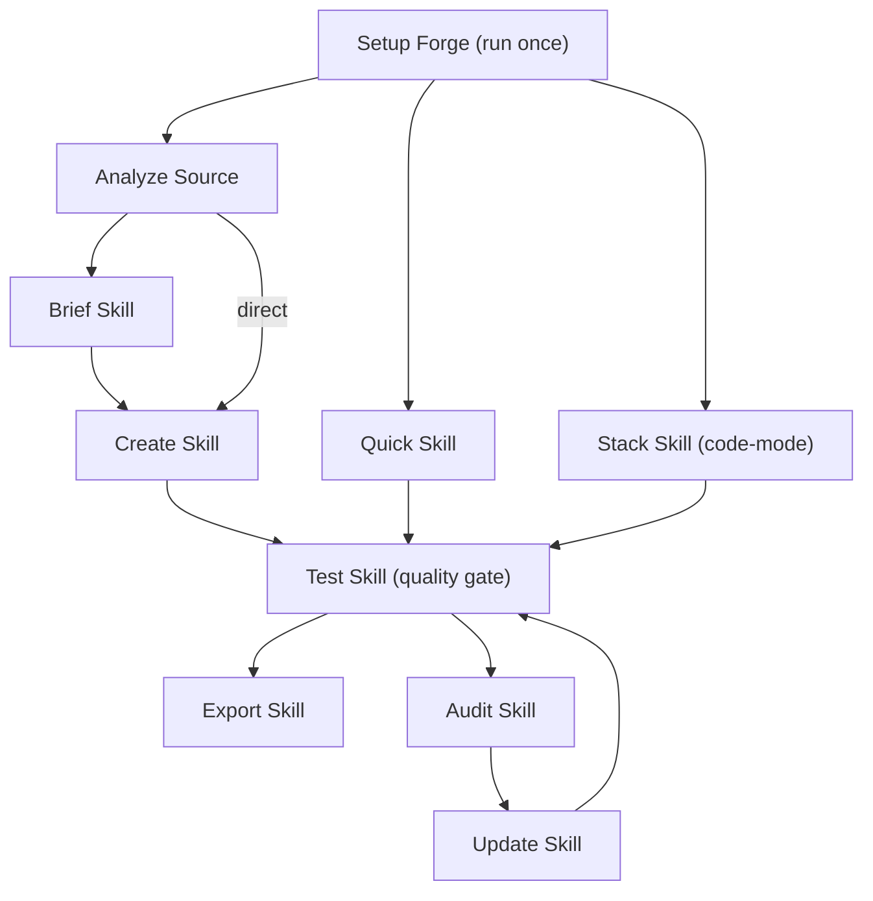
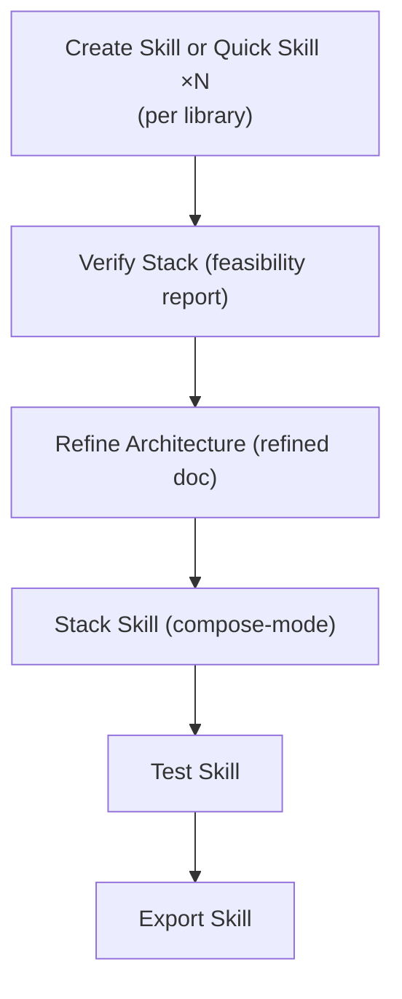
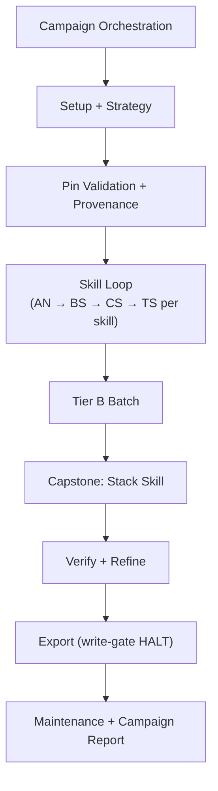

Trigger workflows by typing commands to [Ferris](/docs/agents.md). See [Concepts](/docs/concepts.md) for definitions.

Each workflow is also a skill you can run directly, without Ferris: `/skf-setup` (SF), `/skf-brief-skill` (BS), `/skf-create-skill` (CS), `/skf-update-skill` (US), `/skf-quick-skill` (QS), `/skf-create-stack-skill` (SS), `/skf-analyze-source` (AN), `/skf-audit-skill` (AS), `/skf-test-skill` (TS), `/skf-verify-stack` (VS), `/skf-refine-architecture` (RA), `/skf-export-skill` (EX), `/skf-rename-skill` (RS), `/skf-drop-skill` (DS) and `/skf-campaign` (campaign).

> Already using BMAD? See [BMAD Synergy](/docs/bmad-synergy.md) for when to invoke each SKF workflow during BMM phases and alongside TEA, BMB, and GDS.

---

## Core Workflows

### Setup Forge (SF)

**Command:** `@Ferris SF`

**Purpose:** Initialize the forge environment: detect tools (ast-grep, ccc, gh, qmd), set the capability tier, index the project in CCC when ccc is installed, and check QMD collection health (Deep). The tier follows the tools you have: Quick needs none, Forge needs ast-grep, Forge+ needs ast-grep and ccc, and Deep needs ast-grep, gh and qmd. Each of these tools counts only at its minimum version or newer (the minimums are in [`src/shared/tool-requirements.yaml`](https://github.com/armelhbobdad/bmad-module-skill-forge/blob/main/src/shared/tool-requirements.yaml)), so an ast-grep older than 0.45.3 leaves you at Quick. A tool below its minimum gets an upgrade line in FORGE STATUS and a `tool_below_minimum` warning in `SKF_SETUP_RESULT_JSON`.

**When to Use:** First time using SKF in a project. Run it again after you install, upgrade or remove one of these tools, so SKF picks up the new tier.

**Key Steps:** Detect tools + Determine tier → CCC index check (when ccc is installed) → Write forge-tier.yaml → QMD + CCC registry hygiene (QMD at Deep, CCC whenever ccc is installed) → Status report

**Flags:**

- `--require-tier=<Quick|Forge|Forge+|Deep>` (or `--require-tier <tier>`): stop early in CI when the detected tier is not enough. The value must be one of the four tier names exactly, capitals included. Any other value, such as `deep`, is no miss: setup halts before it probes a tool, with a reason that names the valid tiers (and suggests `Deep` for `deep`), and a `--headless` or `--quiet` run ends `blocked` with `error.phase` `step 1:detect-tools`. SKF checks the tools the requested tier needs, not the tier names, so Deep does not count as Forge+ (Deep does not need ccc). On a miss the workflow halts without running the health check. Interactive runs show a "REQUIRED TIER NOT MET" block; `--headless` and `--quiet` runs show only the envelope, with `status: "tier_failure"`. Pipelines branch on the envelope's `status` field, which is `tier_failure` for a miss.
- `--orphan-action=<keep|remove>`: answer the question about removing orphaned QMD collections without a prompt, even outside `--headless`. Without it, `--headless` and `--quiet` keep the orphaned collections. Any other value halts the run before setup does anything (`error.phase` `on-activation:orphan-action-invalid`).
- `--ccc-skip-index`: skip building the CCC index (the envelope's `ccc_index.status` becomes `"skipped"`). SKF still prepares the ccc settings and keeps its exclusions current. Use it to refresh the detected tier quickly without paying for a full re-index.
- `--quiet`: an alias of `--headless`, for pipelines and expert re-runs, and a forger pipeline runs setup the same way. The `SKF_SETUP_RESULT_JSON` envelope replaces the FORGE STATUS banner and the health-check output, and the orphan question keeps orphaned collections instead of asking (recorded as `quiet-default` in the envelope's `warnings`).
- `--headless` / `-H`: see [Headless Mode](#headless-mode) below. For `/skf-setup`, headless mode prints a single-line `SKF_SETUP_RESULT_JSON: {…}` envelope to stdout in place of the status banner and the health-check output. The envelope follows a fixed schema: `status` is the field to branch on, and it also carries `tier`, `previous_tier`, `tier_changed`, `tools`, `tools_added`/`removed`, `files_written`, `warnings` and `error`. Everything a pipeline needs is on that one line, and it is the run's final message, so it is all `claude -p` prints.

**Agent:** Ferris (Architect mode)

---

### Brief Skill (BS)

**Command:** `@Ferris BS`

**Purpose:** Scope and design a skill through guided discovery.

**When to Use:** Before `Create Skill` when you want maximum control over what gets compiled.

**Key Steps:** Gather intent → Analyze target → Define scope → Confirm brief → Write skill-brief.yaml

**The brief file.** Brief Skill writes `forge-data/<name>/skill-brief.yaml`. You can edit it before Create Skill runs. The fields you are most likely to change:

- `name`: the skill's folder name, in kebab-case.
- `source_repo`: a GitHub URL or local path. Set `source_type: docs-only` and list `doc_urls` to build from documentation instead.
- `target_version` pins a version. `target_ref` names the exact tag or branch when the tags do not match the version.
- `scope.type` (`full-library`, `specific-modules`, `public-api`, `component-library`, `reference-app` or `docs-only`), with `scope.include` and `scope.exclude` globs.
- `description`: one to three sentences that must contain the words `Use when`.
- `source_authority`: `community` by default. Set `official` only if you maintain the library, or `internal` for your team's own code.
- `scripts_intent` and `assets_intent`: `detect` (the default), `none`, or a short description of what you expect.

**Agent:** Ferris (Architect mode)

---

### Create Skill (CS)

**Command:** `@Ferris CS`

**Purpose:** Compile a skill from a brief. Supports `--batch` for multiple briefs.

**When to Use:** After Brief Skill, or with an existing skill-brief.yaml.

**Key Steps:** Load brief → Ecosystem check → Extract (AST + scripts/assets) → QMD enrich (Deep) → Compile → Doc sources → Auto-shard → Doc-rot → Validate (skill-check; Tessl Review when you opt in) → Generate

**Safety:** Writes a version only into a skill folder SKF generated, or a new one. When `skills_output_folder` already holds a folder with the skill's name that SKF did not generate, or a version folder SKF did not generate, it stops before writing anything (`not-skf-output`); an SKF skill still in the old flat layout stops with `flat-layout` until `@Ferris TS` moves it. Set a different `name` in the brief to create the skill beside a folder SKF did not generate.

**Agent:** Ferris (Architect mode)

---

### Update Skill (US)

**Command:** `@Ferris US`

**Purpose:** Regenerates the skill while preserving `[MANUAL]` sections.

**When to Use:** After source code changes when an existing skill needs updating.

**Key Steps:** Load existing → Fetch the source at the skill's ref → Detect changes (incl. scripts/assets) → Re-extract → Merge (preserve MANUAL) → Validate → Write (records the commit it read) → Report

**Source:** For a skill built from a remote repository, Update Skill reads the commit the skill's `source_ref` (a tag, a branch or the default branch) points to now, in a checkout of its own, and records that commit as the skill's `source_commit` when it writes. Pass `--target-ref <tag|branch|HEAD|commit>` to move the skill to another ref, such as a newer release, or to one exact commit (give the full 40-character hash). `--detect-only` and `--dry-run` read the same way and write nothing. A skill built from a local folder is read as that folder stands, and a gap-driven run (`--from-test-report`) reads the commit the skill is pinned to.

**Versions:** An update that writes produces a new version of the skill, in a folder of its own beside the previous version, which stays unchanged. For a skill built from a remote repository, the new version is the source's version when that is higher; otherwise it is the next patch version. `active` then points at the new version, and the next update starts from it, exported or not. Update Skill stops rather than overwrite a version that already exists. A gap-driven run updates the current version in place.

**Modes:** By default, Update Skill compares the skill with its source and rebuilds what changed. To repair the gaps a failed test found, run `@Ferris US <name> --from-test-report`: it reads the newest test report and fixes the skill at its pinned commit. It routes each gap by its category, so a missing export, which Test Skill rates Medium, is still re-extracted from the files its remediation names. A default run first looks for an unconsumed test report: a failed or pass-with-drift report newer than the skill that no repair has applied. It then offers to repair that report's gaps (`[G]`) or to check the source for changes (`[S]`), and a headless run checks the source and adds an `unconsumed-test-report` warning. Stack skills are not updated here. Update Skill sends you to `@Ferris SS` to rebuild the stack.

**Preview:** `--detect-only` lists the changes and stops. `--dry-run` also re-extracts and shows what would change. Neither writes anything.

**Headless:** A skill with no `provenance-map.json`, such as one made by Quick Skill, needs a full rebuild. A headless run stops with `blocked` there unless you pass `--allow-degraded`. In the `SKF_UPDATE_RESULT_JSON` line, `skf_update.status` values `success`, `no-changes`, `detect-only` and `dry-run` all mean the run went fine.

**Agent:** Ferris (Surgeon mode)

---

## Feature Workflows

### Quick Skill (QS)

**Command:** `@Ferris QS <package-or-url>` or `@Ferris QS <package-or-url>@<version>`

**Purpose:** Brief-less fast skill with package-to-repo resolution.

**Note:** QS ignores your forge tier. Every Quick Skill is built the Quick-tier way (its `metadata.json` records `confidence_tier: "Quick"` and `source_authority: "community"`) and uses none of ast-grep, CCC or QMD, even when your forge is set to Forge+ or Deep. For a skill built at your forge tier, use `BS → CS`, `forge`, or `forge-auto`. See [Skill Model](/docs/skill-model.md).

**When to Use:** When you need a skill quickly, with no brief. Accepts package names or GitHub URLs. Append `@version` to target a specific version (for example `@Ferris QS cognee@1.0.0`).

**Key Steps:** Resolve target → Ecosystem check → Quick extract → Compile → Write and validate → Finalize

**Skills modules:** Quick Skill also recognizes a repository that ships agent skills rather than code, such as a BMAD module or a plain Agent Skills package (`repo_shape: skills-module`). It reads each skill's `SKILL.md` frontmatter and the module's `module-help.csv` when there is one, lists the skill names and menu codes as the skill's Key Exports and in the `exports` of its `metadata.json`, and takes Usage Patterns from the `module-help.csv` rows. The skills come from the folder your scope hint names (`scope=<path>` on a batch line). Without one, they come from the repository root or a top-level folder that holds `module.yaml` or `module-help.csv`, or from a folder of skill folders when the repository root has no package manifest, or one that publishes no code, so a library that ships an agent skill beside its code stays a library. When a run that stays a library finds no exports but the repository holds skill folders, its extraction note names the folder to re-run with as the scope hint.

**Headless / batch flags:**

- `--headless` / `-H`: auto-proceed through every confirmation gate with its documented default, print structured progress events to stderr, and exit with stable codes (see [Headless Mode](#headless-mode))
- `--batch <file>`: process several targets from a text file in sequence (one target per line; `#` comments and the per-line modifiers `language=<lang>` and `scope=<path>` are supported). Implies `--headless`.
- `--fail-fast`: only with `--batch`. Stop the whole batch at the first failed target instead of recording the failure and moving on.

**Per-target overrides** (`--skip-snippet` and `--no-active-pointer` also apply to every target in `--batch`):

- `--description "<string>"`: replace the LLM-derived description used in the `SKILL.md` frontmatter and `metadata.json`. Single-target runs only.
- `--exports "name1,name2,..."`: replace the extracted export list (comma-separated). Single-target runs only.
- `--skip-snippet`: skip writing `context-snippet.md`
- `--no-active-pointer`: leave the `active` pointer where it is at the end of the run (the files still land in `{skill_package}`)

`--description` and `--exports` do not combine with `--batch`, because one description or export list cannot fit every target: such a run stops before its first target with exit `2` (`input-invalid`) and writes no batch summary. To give a target its own description or export list, run it on its own.

**Safety:** Writes a version only into a skill folder SKF generated, or a new one; otherwise it stops with exit `9` (`not-skf-output`, or `flat-layout` for an SKF skill in the old flat layout) before writing anything. Quick Skill names a skill after its target, so use `BS` → `CS` to create it under another name.

**Agent:** Ferris (Architect mode)

---

### Stack Skill (SS)

**Command:** `@Ferris SS`

**Purpose:** Consolidated project stack skill with integration patterns. Supports two modes: **code-mode** (analyzes a codebase) and **compose-mode** (builds the stack from skills you already generated, plus an architecture document if you have one; no codebase needed).

**When to Use:** When you want your agent to understand your entire project stack, not just individual libraries. Use code-mode for existing projects. SS uses compose-mode when you give it an architecture document or ask for compose mode. It also offers compose-mode when the project has no dependency manifests but SKF-generated skills exist, and headless runs accept that offer. Compose-mode is the usual next step after the VS → RA verification path.

**Key Steps (code-mode):** Detect manifests → Rank dependencies → Scope confirmation → Parallel extract → Detect integrations → Compile stack → Generate references

**Key Steps (compose-mode):** Load existing skills → Confirm scope → Detect integrations from architecture doc → Compile stack → Generate references

**Safety:** Writes the stack only into a `<project>-stack` folder SKF generated, or a new one; otherwise it stops with exit `5` (`not-skf-output` or `flat-layout`) before writing anything. Compose-mode loads only the skills SKF generated.

**Agent:** Ferris (Architect mode)

---

### Analyze Source (AN)

**Command:** `@Ferris AN`

**Purpose:** Decomposes a repo to discover what's worth skilling, and recommends a stack skill.

**When to Use:** Brownfield onboarding of large repos or multi-service projects.

**Key Steps:** Init → Scan project → Identify units → Map exports & detect integrations → Recommend → Generate briefs

**Note:** Supports resume. If the session is interrupted mid-analysis, run `@Ferris AN` again and Ferris resumes from where it left off.

**Agent:** Ferris (Architect mode)

---

## Quality Workflows

### Audit Skill (AS)

**Command:** `@Ferris AS`

**Purpose:** Drift detection between skill and current source.

**When to Use:** To check if a skill has fallen out of date with its source code. Works for both individual skills and stack skills.

**Key Steps:** Load skill → Re-index source → Structural diff (incl. script/asset drift) → Semantic diff (Deep) → Classify severity → Doc drift → Report

**Version read:** An audit reads the version the skill's `active` link names, also when the export manifest still names an older one (after an update, before the next export). In that case an interactive run offers `[M]` to audit the manifest's version instead.

**Doc drift:** A skill compiled before SKF 3.0.0 recorded its README as a `blob/main` page, or as a URL with no scheme, so doc drift keeps flagging its README until Create Skill compiles it again and records the raw README at the ref the skill was built from.

**Stack skill support:** Code-mode stacks are audited library by library against their sources. Compose-mode stacks check that each constituent skill is still current by comparing metadata hashes: if a constituent skill was updated after the stack was composed, the audit flags it as constituent drift. Update Skill cannot patch a stack. When a stack needs updating, Update Skill sends you to `@Ferris SS` to compose it again.

**Output:** A drift report at `forge-data/<name>/<version>/drift-report-<timestamp>.md`. Its overall drift score is CLEAN, MINOR, SIGNIFICANT or CRITICAL. CLEAN means there is nothing to do and the skill is ready to export. Otherwise the report ends with the next step, usually `@Ferris US <name>`. Each run also keeps the JSON its score came from (the structural diff, the findings built from it and their classification) beside the drift report, in `forge-data/<name>/<version>/.skf-audit/<timestamp>/`.

**Agent:** Ferris (Audit mode)

---

### Test Skill (TS)

**Command:** `@Ferris TS`

**Purpose:** Verifies whether a skill covers its target completely and accurately. An individual skill is tested in naive mode (coverage of its public API). A stack skill is tested in contextual mode, which also checks that its references and integration patterns hold together. Quality gate before export.

**When to Use:** After creating or updating a skill, before exporting.

**Key Steps:** Load skill → Detect mode → Coverage check → Coherence check → External validation (skill-check; Tessl Review when you opt in) → Hard gate → Score → Gap report

**Scored Categories:** Export Coverage, Signature Accuracy, Type Coverage, Coherence and External Validation, weighted by the kind of skill. An individual skill (naive mode) does not score Coherence, and its weights are 45%, 25%, 20% and 10%. A stack skill (contextual mode) starts from 36%, 22%, 14%, 18% and 10%, but Signature Accuracy and Type Coverage are not scored for a stack, because they would grade other libraries' APIs, so their weight moves to the other three categories. At Quick tier, Signature Accuracy and Type Coverage are skipped for every skill in the same way.

Default pass threshold: **80%**. Inside a pipeline the default follows the alias: `forge-auto` uses 90%, `forge` and `forge-quick` use 80%, and a campaign uses 90%. Pass `--threshold=<N>` to set your own bar. When the bar is above 80% and a skill scores at least 80% but under the bar, it still passes at the 80% floor, and Test Skill writes `evidence-report-fallback.md` to record the gap. Pass routes to Export Skill; fail routes to Update Skill with a gap report. See [Completeness Scoring](/docs/verifying-a-skill.md#how-the-score-is-computed) for the full formula and tier adjustments.

**Flags:**

- `--threshold=<N>` sets the pass score for this run. It wins over pipeline defaults.
- `--tier=<Quick|Forge|Forge+|Deep>` tests at that tier without reading `forge-tier.yaml`, which helps in CI before setup has run.
- `--no-discovery` leaves the discovery-testing block out of the report.
- `--allow-workspace-drift` reads the source at its current commit instead of the pinned one (see [Verifying a Skill](/docs/verifying-a-skill.md#workflow-time-enforcement)). Update Skill with `--from-test-report` takes the same flag, but takes nothing from that commit: it never moves or records a provenance line from it and reads no signature, parameter list, return type or node kind there, so a test report with a new or changed export, whatever its severity, stops it with `halted-for-workspace-drift` before it changes the skill. A rescope (a removed export) stops it the same way, because its public API recount needs the pinned tree: the run has not written the brief amendment yet, so the brief stays as it was and a re-run asks again. When no gap needs the source, the stats keep the public API counts `metadata.json` records.

**Verdicts and exit codes (headless):** `0` PASS, `2` FAIL, `3` INCONCLUSIVE, `4` pass-with-drift, and `1` for a halt before any verdict. The `SKF_TEST_RESULT_JSON` line carries the same verdict and score. A run the hard gate blocks on a Critical or High gap is a FAIL as well: it still writes the Gap Report and a FAIL result record, runs `on_complete` and the health check, then exits `2`, and its result line, printed on stderr instead of stdout, has `status: "error"`, `halt_reason: "hard-gate-blocked"` and no score.

**Agent:** Ferris (Audit mode)

---

## Architecture Verification Workflows

### Verify Stack (VS)

**Command:** `@Ferris VS`

**Purpose:** Pre-code stack feasibility verification. Cross-references generated skills against architecture and PRD documents with three passes: coverage, integration compatibility, and requirements.

**When to Use:** After generating individual skills with CS or QS, and before building a stack skill, to check that the tech stack can support the architecture.

**Key Steps:** Load skills + docs → Coverage analysis → Integration verification → Requirements check → Synthesize verdict → Present report

**Skills read:** Only the skills SKF generated. Other skills in `skills_output_folder`, such as a module's own, are listed once as "Skipped (not SKF output)" and count toward no inventory check or pair. A `metadata.json` SKF cannot read still counts as one warning, because SKF then cannot tell whether it generated that skill.

**Inputs:** Your architecture document (required), a PRD (optional), and at least two SKF skills in `skills_output_folder`. **Output:** `feasibility-report-<project>-<timestamp>.md` plus a `-latest.md` copy in `forge-data/`, with an overall verdict of FEASIBLE, CONDITIONALLY_FEASIBLE or NOT_FEASIBLE. When an earlier report exists, VS offers to compare against it so you see what changed.

**Verdicts:** `FEASIBLE` means every technology the architecture keeps has a skill, every integration pair is `Verified` (one of its two skills cites the other literally) and, when you gave a PRD, every requirement is met. VS takes integration pairs from a stack skill's `integration_patterns` when one built by Stack Skill (SS) is in the inventory, and otherwise from the architecture document's prose, never from a Mermaid diagram. A run that finds no pair between two or more covered technologies, as when the integrations are drawn only in a diagram, ends `CONDITIONALLY_FEASIBLE`, because no integration was verified, and recommends describing them in prose. A weak result never stops VS early: a run that covers none of the technologies, finds every one marked for removal, or finds every pair `Blocked` prints a warning and finishes `NOT_FEASIBLE`, with a recommendation for each gap, such as a replacement library or a bridge for each Blocked pair.

**Agent:** Ferris (Audit mode)

---

### Refine Architecture (RA)

**Command:** `@Ferris RA`

**Purpose:** Improves an architecture document using verified skill data as evidence. Takes the original architecture doc, the generated skills and an optional VS report, then fills gaps, flags contradictions and suggests improvements, each citing specific APIs.

**When to Use:** After VS confirms feasibility, before running SS in compose-mode. Produces a refined architecture ready for stack skill composition.

**Key Steps:** Load inputs → Gap analysis (confirms a derived scope) → Issue detection → Improvement detection → Compile refined doc → Present report

**Scope:** RA refines the document with the skills in its scope: the ones you name with `--scope-skills`, or else the ones the document mentions (a skill whose relevance is unclear stays in scope). When it works out the scope itself and leaves skills out, it shows which skills are in and out of scope before it reads their APIs: type `C` to keep the scope, a skill's name to bring it in, or `-<name>` to take it out. A headless run keeps the derived scope and logs that decision. Integration pairs, VS verdicts and improvement suggestions that involve an out-of-scope skill are listed for awareness only and stay out of the refined document.

**Skills read:** Only the skills SKF generated. Other skills in `skills_output_folder`, such as a module's own, are listed once as "Skipped (not SKF output)" and count toward no inventory check or pair. A `metadata.json` SKF cannot read still counts as one warning, because SKF then cannot tell whether it generated that skill.

**Feasibility report:** RA finds the newest Verify Stack report itself, `feasibility-report-<slug>-latest.md` in `forge_data_folder`, and offers it as the default: press Enter to use it, or give another path. A headless run uses it and logs that it did. Pass `--vs-report-path <path>` to use another report, or `--vs-report-path none` to refine without one. RA checks the report against the feasibility-report contract before it reads it, and stops with exit `2` (`input-invalid`) on one that breaks it (see [Headless Mode](#headless-mode) for every RA exit code).

**Output:** `refined-architecture-<project>.md` in `output_folder` (`_bmad-output/` in a standalone install). It writes a new file and leaves your architecture document as it is. Its Refinement Summary counts the gaps, issues and improvements, and its `Not verified (no skill)` row names the libraries, databases and services the document mentions but no skill covers: nothing checked what the document says about them. A `VS Coverage` row shows the Verify Stack report's coverage when RA used one. When technologies are not verified, the next steps say to create their skills with `@Ferris CS` or `@Ferris QS` and run RA again before Stack Skill.

**Agent:** Ferris (Architect mode)

---

## Utility Workflows

### Export Skill (EX)

**Command:** `@Ferris EX`

**Purpose:** Validate package structure, generate context snippets, and inject managed sections into CLAUDE.md/AGENTS.md/.cursorrules.

**When to Use:** When a skill is ready for CLAUDE.md/AGENTS.md integration. Also provides a local install command (`npx skills add <path>`) and distribution instructions for `npx skills publish`. See [Installation → Source Formats](https://www.npmjs.com/package/skills#installation) for other install methods.

**Key Steps:** Load skill → Validate package → Generate snippet → Update context file (CLAUDE.md/AGENTS.md/.cursorrules) → Token report → Summary

**Flags:**

- Name several skills (`@Ferris EX skill-a skill-b`) to export them in one run. Each confirmation covers the whole batch, not one skill at a time.
- `--all` exports every skill listed in `.export-manifest.json`, except deprecated ones. On a first export, with no manifest yet, it exports every SKF skill in `skills_output_folder`.
- `--dry-run` shows the snippet, context-file and manifest changes and writes nothing.

**Good to know:** Export warns when a skill has no test report, failed its last test, or its last test was inconclusive or passed only under `--allow-workspace-drift`, but it still exports if you confirm. With passive context on (the default), it writes each skill's `context-snippet.md` last, after you confirm the context-file change, so a cancelled or halted export leaves the snippet as it was. Set `passive_context: false` in your preferences to package skills without touching `CLAUDE.md`, `AGENTS.md` or `.cursorrules`: such a run writes no snippet.

**Agent:** Ferris (Delivery mode)

---

## Orchestration Workflows

### Campaign Orchestration

**Command:** `@Ferris CA` or `@Ferris campaign`

`@Ferris campaign` starts a campaign, or offers to resume one that exists. `@Ferris campaign resume [--from=<skill>]` resumes from the last active skill or the one you name, and `@Ferris campaign status` shows progress without changing anything. Pass `--brief <file>` or `--manifest <file>` to seed the target list from a file; either one runs the campaign headless. See [Campaign Orchestration](/docs/campaign.md).

**Purpose:** Orchestrate multi-library skill production across sessions with dependency tracking and resume.

**When to Use:** When you need to produce 15 or more coordinated skills in dependency order, too many to run one pipeline at a time by hand.

**Key Steps:** Setup → Strategy → Pin Validation → Provenance → Skill Loop (the full pipeline for each Tier A skill) → Tier B Batch (secondary dependencies, built in one Quick Skill batch) → Capstone (one stack skill that ties all the skills together) → Verify → Refine → Export (waits for your approval, except in headless runs) → Maintenance

**Agent:** Ferris (Management mode)

---

## Management Workflows

### Rename Skill (RS)

**Command:** `@Ferris RS`

**Purpose:** Rename a skill across all its versions. Because the agentskills.io spec requires `name` to match parent directory name, this is a coordinated move across outer/inner directories, SKILL.md frontmatter, metadata.json, context snippets, provenance maps, the export manifest, and platform context files.

**When to Use:** You need to change a skill's name. For example, give a `QS`-generated skill (named after its repo) a formal name, or add a suffix like `-community` to tell it apart from an official skill.

**Key Steps:** Select skill + new name → Transactional copy → Update all references → Rebuild context files → Delete old name (point of no return)

**Safety:** Transactional: if any step fails before the final delete, the old skill stays intact. Warns if `source_authority: "official"` (rename is local-only; published registry skill won't change). Renames only skills SKF generated in the versioned layout: a folder whose `metadata.json` carries no SKF marker, or one that also holds files SKF did not generate, is refused, and a skill still in the old flat layout must first be moved into the versioned layout by running `@Ferris TS` (or `US`, `AS`, `EX`) on it. It moves the skill's folder in `forge_data_folder` only when SKF generated it: it refuses one that also holds other files or that is a link, is not a folder, or cannot be listed, and leaves another tool's folder of the same name where it is.

**Preview first:** Add `--dry-run` to `@Ferris RS` or `@Ferris DS` to see which folders, manifest entries and context files would change. Nothing is written or deleted.

**Agent:** Ferris (Management mode)

---

### Drop Skill (DS)

**Command:** `@Ferris DS`

**Purpose:** Drop a specific skill version or an entire skill. Soft drop (default) marks the version as deprecated in the manifest and keeps files on disk. Hard drop (`--mode purge`) also deletes the files.

**When to Use:** Retire a deprecated version (e.g., drop an older cognee skill version because it's obsolete), free disk space, or remove a skill you no longer need.

**Key Steps:** Select skill → Select version(s) + mode → Update manifest → Rebuild context files → Delete files (if purge)

**Safety:** Active version guard: you cannot drop the currently active version while other non-deprecated versions exist (choose the All versions option to drop the whole skill instead). Soft drop is reversible by editing the manifest. Drop offers a skill folder SKF did not generate only when the manifest lists it, and then only for deprecate. A purge deletes only SKF output: a whole-skill purge of a folder that also holds other files is refused, and so is a purge through a link. The same goes for the skill's folder in `forge_data_folder`, except that a folder there SKF did not generate (another tool's folder of the same name, or a link) is left in place and named in the report. A headless drop of a skill with no manifest entry needs `--mode purge`. A headless drop of a skill in the export manifest needs `version=all` or the one version to drop: without it, the run stops with exit `2` (`input-missing`) before it changes anything. A specific version for a draft skill (one with no manifest entry) stops with exit `2` (`input-invalid`) in every mode, since a draft is dropped whole.

**Preview first:** Add `--dry-run` to `@Ferris RS` or `@Ferris DS` to see which folders, manifest entries and context files would change. Nothing is written or deleted.

**Agent:** Ferris (Management mode)

---

## Workflow Connections

**Standard path (code-mode):**



**Pre-code verification path (compose-mode):**



**Campaign orchestration path:**



> **One workflow per session** (unless you use pipeline mode or a campaign). Each arrow in the standard and compose-mode diagrams stands for a new conversation session. A campaign runs its own sessions; see [Campaign Orchestration](/docs/campaign.md). Clear your context between workflows for best results, or use pipeline mode to chain them automatically. See [Pipeline Mode](#pipeline-mode) below.

---

## Workflow Categories

| Category                  | Workflows         | Description                                                                                                                      |
| ------------------------- | ----------------- | -------------------------------------------------------------------------------------------------------------------------------- |
| Core                      | SF, BS, CS, US    | Setup, brief, create, and update skills                                                                                          |
| Feature                   | QS, SS, AN        | Quick skill, stack skill, and analyze source                                                                                     |
| Quality                   | AS, TS            | Detect skill drift (AS) and verify skill completeness (TS)                                                                       |
| Architecture Verification | VS, RA            | Pre-code architecture feasibility and refinement                                                                                 |
| Orchestration             | Campaign          | Multi-library skill production with dependency tracking and resume                                                               |
| Management                | RS, DS            | Rename a skill across all its versions, or drop one version or a whole skill                                                     |
| Utility                   | EX                | Package and export for consumption                                                                                               |
| In-Agent                  | WS, KI            | WS: show lifecycle position, active briefs, and forge tier; KI: list knowledge fragments (both in-agent, no file-based workflow) |

---

## Pipeline Mode

Instead of running one workflow per session, you can chain multiple workflows in a single command. Ferris executes them left to right, passing data (brief path, skill name) between each workflow automatically.

### Syntax

| Command | What it does |
| --- | --- |
| `@Ferris BS CS TS EX` | Runs the codes left to right, separated by spaces |
| `@Ferris BS -> CS -> TS -> EX` | The same run, with arrows between the codes |
| `@Ferris QS[cocoindex] TS EX` | Passes a target to one workflow in brackets |
| `@Ferris CS TS[min:80] EX` | Overrides a circuit breaker threshold |
| `@Ferris forge-quick cognee` | Runs a named alias with its target |

### Pipeline Aliases

The `forge-auto` alias is the recommended way to create skills: one command, no configuration. It chains five workflows with auto-mode flags, so you get a verified skill without writing a brief or a scope file.

| Alias         | Expands To                           | First Workflow | Required Target                                                |
| ------------- | ------------------------------------ | -------------- | -------------------------------------------------------------- |
| `forge-auto`  | `AN[auto] BS[auto] CS TS[min:90] EX` | AN             | Repo URL, local path or doc URL (add `--pin <version>` to pin a version) |
| `forge`       | `BS CS TS EX`                        | BS             | GitHub URL or local path **+** skill name                      |
| `forge-quick` | `QS TS EX`                           | QS             | GitHub URL **or** package name                                 |
| `maintain`    | `AS US TS EX`                        | AS             | Existing skill name                                            |

**The first workflow's input contract defines what arguments the pipeline needs.** A bare package name works for `forge-quick` (QS resolves packages through the registry) but **not** for `forge`, because BS needs both an unambiguous target (URL or path) and a skill name.

### How It Works

- Pipelines **automatically turn on headless mode**: every confirmation gate auto-proceeds with its default action
- **Data flows automatically**: once the first workflow completes, its brief path or skill name becomes the input for the next workflows
- **Circuit breakers** stop the pipeline when a step's result is not good enough: AN finds nothing worth making into a skill, CS hits a hard error, AS finds CRITICAL drift, VS finds every integration blocked, or TS fails. TS fails on a Critical or High gap, or on a score below its threshold. A TS score between 80% and a higher pipeline target (90% for `forge-auto`) passes with a fallback evidence report.
- **`maintain` skips what it does not need.** When AS finds no drift (CLEAN), Update Skill is skipped. When AS finds CRITICAL drift, `maintain` stops so you can review the drift report; then run `@Ferris US <name>` yourself.
- **Resume:** each pipeline records its progress in the forger sidecar. If one stopped partway, Ferris offers to run the remaining steps the next time you start him.
- **Anti-pattern warnings**: Ferris warns if you chain workflows in a problematic order (for example, exporting before testing)
- **Progress reporting**: Ferris reports each workflow's completion before starting the next
- **Safe halt on ambiguity**: headless mode won't guess. If the first target doesn't satisfy the first workflow's contract (for example `forge cognee`, which is neither a URL nor a path), the pipeline halts at step 1 before any work happens and suggests concrete next steps.
- Codes can be separated by spaces or by arrows: `AN -> CS -> TS -> EX`.

### Examples

| Command | What it does |
| --- | --- |
| `@Ferris forge-auto https://github.com/honojs/hono` | Zero-ceremony skill |
| `@Ferris forge-auto https://docs.example.com` | Docs-only skill |
| `@Ferris forge-auto https://github.com/honojs/hono --pin v4.6.0` | Pinned version |
| `@Ferris forge-quick @tanstack/query` | QS + TS + EX for TanStack Query |
| `@Ferris forge https://github.com/topoteretes/cognee cognee` | BS + CS + TS + EX with an explicit URL and name |
| `@Ferris forge https://github.com/topoteretes/cognee cognee "public API only"` | The same, with a scope hint |
| `@Ferris maintain cocoindex` | AS + US + TS + EX for an existing cocoindex skill |

---

## Headless Mode

Add `--headless` or `-H` to any workflow command to skip all confirmation gates. Ferris auto-proceeds with the default actions (typically "Continue") and logs each auto-decision. Progress output is still shown: headless skips interaction, not reporting.

| Command | What it does |
| --- | --- |
| `@Ferris QS cocoindex --headless` | Quick skill with no interaction gates |
| `@Ferris TS cocoindex --headless` | Tests the cocoindex skill and ends with its `SKF_TEST_RESULT_JSON` line |
| `@Ferris EX cocoindex -H` | Exports the cocoindex skill with an auto-approved context update. A headless export needs a skill name or `--all` |

You can also set `headless_mode: true` in your forge preferences (`_bmad/_memory/forger-sidecar/preferences.yaml`) to make headless the default for all workflows. Headless never turns Tessl Review on: create-skill and test-skill send a skill to Tessl only when `tessl_review_workspace` is set in the same file, and then they do so in headless runs too.

**Exception: `/skf-setup` headless emits a single-line JSON envelope.** Unlike other workflows, headless (or `--quiet`) `/skf-setup` skips its status banner, progress lines and health-check output and ends on one prefixed envelope line. What setup guarantees is that this line is the run's final message, so it is exactly what `claude -p` prints; an interactive session or a `stream-json` reader may still see brief agent notes between tool calls. On success the health check runs first and the envelope follows it. On a tier miss or a halt the health check does not run, and the `status: "tier_failure"` envelope, or a `status: "blocked"` envelope whose `error.reason` carries the diagnostic, is the final message. Two cases have no envelope: when SKF's scripts are not installed in the project (a directory that is not an SKF project, or a helper-missing halt because they are gone), there is no helper to build one, and when an early halt (config missing or malformed, or `uv` missing) finds neither `uv` nor a Python interpreter (`python3`, `python` or `py -3`) to run the helper. Either way the run's one line is the bare halt reason. Pipelines should treat a missing envelope as a failure. When the forger runs `SF` as one step of a pipeline, setup displays the same line and hands control back to the forger, which keeps chaining. The success envelope looks like this:

```
SKF_SETUP_RESULT_JSON: {"skf_setup":{"status":"success","tier":"Deep","previous_tier":"Forge","tier_changed":true,"tools":{...},"tools_added":[...],"tools_removed":[],"config_path":"...","ccc_index":{...},"files_written":[...],"tier_override_active":false,"tier_override_invalid":false,"require_tier_satisfied":null,"warnings":[],"error":null}}
```

Parent skills and CI pipelines `grep` one line out of the workflow log to learn the outcome, with no ASCII-art parsing and no race against the [`forge-tier.yaml`](https://github.com/armelhbobdad/bmad-module-skill-forge/blob/main/src/skf-setup/references/write-config.md) writer. Branch on the top-level `status` field (`success`, `tier_failure`, or `blocked`) rather than composing the outcome from `require_tier_satisfied` + `error`. A write failure arrives as `blocked`, with an `error.phase` of `step 2:write-tools` or `step 2:forge-data-dir`. The envelope schema is versioned at [`src/shared/scripts/schemas/skf-setup-result-envelope.v1.json`](https://github.com/armelhbobdad/bmad-module-skill-forge/blob/main/src/shared/scripts/schemas/skf-setup-result-envelope.v1.json) and asserted against on every emit.

**Exception: `/skf-quick-skill` headless emits structured progress and result envelopes.** Headless `/skf-quick-skill` runs are first-class building blocks for batch automators. Four operational contracts go beyond per-gate auto-proceed:

1. **Per-step JSON progress events to `stderr`** at each step's entry, exit and HARD HALT, one line per event, with no pretty-printing:

   ```
   {"step":3,"name":"quick-extract","status":"start"}
   {"step":3,"name":"quick-extract","status":"done"}
   {"step":1,"name":"resolve-target","status":"halt","exit":3}
   ```

   `<name>` is the kebab portion of the step filename: `resolve-target`, `ecosystem-check`, `quick-extract`, `compile`, `write-and-validate`, `finalize`, `health-check`.

2. **Structured exit-code map.** Every HARD HALT exits with a stable code so pipelines branch on the failure class without grepping message text:

   | Code | Meaning             |
   | ---- | ------------------- |
   | 0    | success             |
   | 2    | input-invalid       |
   | 3    | resolution-failure  |
   | 4    | write-failure       |
   | 5    | overwrite-cancelled |
   | 6    | user-cancelled      |
   | 7    | finalize-blocked    |
   | 8    | ecosystem-redirect  |
   | 9    | state-conflict      |

3. **Error-variant result contract on every HARD HALT.** A `SKF_QUICK_SKILL_RESULT_JSON: {…}` envelope is emitted on `stderr` (always) and copied to `{skill_package}/quick-skill-result-latest.json` once the skill package holds `metadata.json` (any HALT from the write step onward, except the exit `9` ownership halt, which writes nothing on disk). The full population rules live in [`src/skf-quick-skill/references/halt-contract.md`](https://github.com/armelhbobdad/bmad-module-skill-forge/blob/main/src/skf-quick-skill/references/halt-contract.md) § "Result Contract on HARD HALT", and the envelope's schema is [`src/shared/scripts/schemas/skf-quick-skill-result-envelope.v1.json`](https://github.com/armelhbobdad/bmad-module-skill-forge/blob/main/src/shared/scripts/schemas/skf-quick-skill-result-envelope.v1.json).

4. **Success result contract.** A finished run prints one `SKF_QUICK_SKILL_RESULT_JSON: {…}` line on `stdout`. Its `summary` carries `quality_score` (the skill-check score of the written package, not a Test Skill score), `validation_issues`, `repo_shape`, `language_resolution` and `active_pointer`, beside the top-level `headless_decisions` and `warnings`, such as `also_found_in` when a headless run kept the first registry's pick of a package name another registry also holds. The run also writes `quick-skill-result-latest.json` in the skill package.

**Batch mode (`--batch <file>`).** Drives N targets in sequence: each target runs steps 1 to 6, and the health check runs once, after the batch summary. Input format: one target per line, `#` comments and blank lines ignored, optional per-line modifiers `language=<lang>` and `scope=<path>`. Each target's output lands in its own `{skill_package}/`; an aggregated summary writes to `{skills_output_folder}/_batch/quick-skill-batch-{ts}.json` (with `quick-skill-batch-latest.json` copy). Per-target boundary events (`{"batch":N,"target":"…","status":"start|done|fail",…}`) and a final `{"batch_summary":true,…}` event extend the per-step event stream above. The batch exits with the highest exit code among its failed targets (`0` when none failed); `--fail-fast` stops it at the first failed target and exits with that target's code. A batch refused before its first target writes no summary and exits `2`, or `4` when its run folder cannot be written. Full input grammar, summary schema, and exit-code rules in [`src/skf-quick-skill/references/batch-mode.md`](https://github.com/armelhbobdad/bmad-module-skill-forge/blob/main/src/skf-quick-skill/references/batch-mode.md).

**Exception: `/skf-brief-skill` headless emits a final result envelope and supports presets.** Headless `/skf-brief-skill` is a first-class building block for scripted brief generation (for example, seeding briefs for N SaaS SDKs that share scope and authority defaults). Three operational contracts go beyond per-gate auto-proceed:

1. **Pre-supplied inputs replace prompts.** Headless arguments are read at step 1's gate in place of the interactive menus: `target_repo`, `skill_name`, `from_brief`, `target_version`, `language_hint`, `scope_hint`, `source_type`, `source_authority`, `doc_urls`, `scope_type`, `include`, `exclude`, `scripts_intent`, `assets_intent`, `intent`, `force`, `preset`. Which arguments are required depends on what you ask for: `target_repo` and `skill_name` for a new brief, plus `doc_urls` when `source_type` is `docs-only`, or only `from_brief` to review an existing brief in place. SKF never guesses a missing `source_authority` or `scope_type`. It detects them from signals instead: `gh api user` against the repo owner for authority, and a five-rule heuristic ladder for scope. Full grammar in [`src/skf-brief-skill/references/headless-args.md`](https://github.com/armelhbobdad/bmad-module-skill-forge/blob/main/src/skf-brief-skill/references/headless-args.md).

2. **Structured exit-code map.** Every HARD HALT exits with a stable code so pipelines branch on the failure class without grepping message text:

   | Code | Meaning                       |
   | ---- | ----------------------------- |
   | 0    | success                       |
   | 2    | input-missing / input-invalid |
   | 3    | resolution-failure            |
   | 4    | write-failure                 |
   | 5    | overwrite-cancelled           |
   | 6    | user-cancelled                |

3. **Final result envelope on every terminal exit.** Step 5 emits a single-line `SKF_BRIEF_RESULT_JSON: {…}` envelope on **stdout** before chaining to step 6 on success; every HARD HALT emits the same envelope shape on **stderr** with `status: "error"` and a typed `halt_reason` (`input-missing`, `input-invalid`, `forge-tier-missing`, `target-inaccessible`, `gh-auth-failed`, `write-failed`, `overwrite-cancelled`, `user-cancelled`). Full envelope schema and population rules in [`src/skf-brief-skill/references/invocation-contract.md`](https://github.com/armelhbobdad/bmad-module-skill-forge/blob/main/src/skf-brief-skill/references/invocation-contract.md) § "Result Contract (Headless)".

**Presets (`--preset <name>`).** Loads `{sidecar_path}/brief-presets/{name}.yaml` and merges its keys as defaults when Brief Skill reads the headless arguments, before it checks them. Headless arguments you pass explicitly override preset values. The preset file is YAML holding any subset of the headless arguments above; unknown fields are ignored with a warning. Presets help with repeated patterns, for example briefing 5 SaaS SDKs that all share `source_authority=community`, `scope_type=full-library` and `scripts_intent=none`.

**Other workflows emit result envelopes too.** In headless mode, AN, US, SS, AS, TS, VS, EX and campaign each print a single-line result envelope when they finish or halt: `SKF_ANALYZE_RESULT_JSON`, `SKF_UPDATE_RESULT_JSON`, `SKF_STACK_RESULT_JSON`, `SKF_AUDIT_RESULT_JSON`, `SKF_TEST_RESULT_JSON`, `SKF_VERIFY_STACK_RESULT_JSON`, `SKF_EXPORT_RESULT_JSON` and `SKF_CAMPAIGN_RESULT_JSON`. CS prints `SKF_CREATE_SKILL_RESULT_JSON` only when it halts; a successful CS run writes `create-skill-result-latest.json` in the skill's version folder under `forge_data_folder` instead. Drop Skill, Rename Skill and Refine Architecture, described below, each emit a single-line `SKF_*_RESULT_JSON: {…}` envelope on every terminal exit (`status: "success"` on the happy path, `status: "error"` with a typed `halt_reason` on any HARD HALT) and exit with a stable code, so automators branch on the failure class without grepping message text. All three honour the universal `cancel`/`exit`/`:q` affordance at any prompt (exit `6`, `halt_reason: "user-cancelled"`).

- **`/skf-drop-skill` (DS)**: exit `2` `input-missing`/`input-invalid` (including `--mode deprecate` on a skill with no manifest entry), `3` resolution-failure (`manifest-corrupt`, `nothing-to-drop`), `4` write-failure (`manifest-write-failed`, `context-rebuild-failed`, `delete-failed` for a failed full purge, `write-failed`), `5` state-conflict (`active-version-guard-refused`; `not-skf-output` for a folder SKF did not generate, a purge it cannot confirm, or a skill whose folder in `forge_data_folder` also holds other files), `6` `user-cancelled` or `headless-purge-forbidden`. Besides `status`, `exit_code` and `halt_reason`, the envelope carries `would_delete` (in a dry run of a purge, the folders the purge would delete), `result_path` (the per-run result file, `null` for a dry run or a halt) and `error` (the `phase` and `reason` of a halt). Exit codes in [`src/skf-drop-skill/SKILL.md`](https://github.com/armelhbobdad/bmad-module-skill-forge/blob/main/src/skf-drop-skill/SKILL.md) § "Exit Codes"; the envelope and full `halt_reason` list in [`src/skf-drop-skill/references/headless-contract.md`](https://github.com/armelhbobdad/bmad-module-skill-forge/blob/main/src/skf-drop-skill/references/headless-contract.md).
- **`/skf-rename-skill` (RS)**: exit `2` `input-missing`/`input-invalid`, `3` resolution-failure (`manifest-corrupt`, `nothing-to-rename`), `4` write-failure (`copy-failed`, `write-failed`, `manifest-write-failed`; the context-file rebuild is best-effort and never halts), `5` state-conflict (`name-collision`, `source-authority-blocked`, `halted-for-concurrent-run`, `not-skf-output` for a folder SKF did not generate, or a forge folder that also holds other files or that is a link, is not a folder, or cannot be listed; `flat-layout` for a skill not yet migrated; `verify-failed` when the old name is still in the renamed files, which rolls the rename back with the old skill intact, see [Troubleshooting](/docs/troubleshooting.md)). Exit codes in [`src/skf-rename-skill/references/exit-codes.md`](https://github.com/armelhbobdad/bmad-module-skill-forge/blob/main/src/skf-rename-skill/references/exit-codes.md); the envelope in [`src/skf-rename-skill/SKILL.md`](https://github.com/armelhbobdad/bmad-module-skill-forge/blob/main/src/skf-rename-skill/SKILL.md) § "Result Contract (Headless)".
- **`/skf-refine-architecture` (RA)**: exit `2` `input-missing`/`input-invalid` (`input-invalid` also covers a Verify Stack report with a `schemaVersion` other than `1.0`, a missing or doubled verdict table, or an unknown verdict token), `3` resolution-failure (`output-folder-unconfigured`, `forge-folder-unconfigured`), `4` write-failure (`write-failed`), `5` state-conflict (`insufficient-skills`: no skill SKF generated was found), `7` `inventory-unreliable`, `8` `recovery-failed` (the saved state is not enough to rebuild the findings, or the compiled doc is missing its `## Refinement Summary`). Schema in [`src/skf-refine-architecture/SKILL.md`](https://github.com/armelhbobdad/bmad-module-skill-forge/blob/main/src/skf-refine-architecture/SKILL.md) § "Exit Codes" / "Result Contract (Headless)".

**Reading the result lines.** Check each line's `status` field first (for US, `skf_update.status`). For most workflows it only says whether the run finished or stopped on an error, so read the outcome from the fields below: a TS run whose skill scores below its threshold still reports `status: "success"`, with `verdict: "FAIL"`. AN, SS, AS, TS, EX and VS also exit with a stable code.

| Workflow | Result line | Fields worth reading |
| --- | --- | --- |
| AN | `SKF_ANALYZE_RESULT_JSON` | `brief_paths`, `unit_counts` |
| CS | `SKF_CREATE_SKILL_RESULT_JSON` (only when it stops early) | `phase`, `summary.halt_reason` |
| SS | `SKF_STACK_RESULT_JSON` | `mode` (`code` or `compose`), `stack_libraries` |
| US | `SKF_UPDATE_RESULT_JSON` | `skf_update.status`: `success`, `no-changes`, `detect-only` and `dry-run` are all good outcomes |
| AS | `SKF_AUDIT_RESULT_JSON` | `drift_score`, `next_workflow` |
| TS | `SKF_TEST_RESULT_JSON` | `verdict`, `score`, `threshold` |
| EX | `SKF_EXPORT_RESULT_JSON` | `context_files_updated` |
| VS | `SKF_VERIFY_STACK_RESULT_JSON` | `overall_verdict`, `coverage_percentage` |

To run these without questions, pass their inputs as flags. Analyze Source takes `--project-path`, `--scope-hint` and `--intent-hint`. Verify Stack takes `--architecture-doc`, `--prd` and `--previous-report`. Refine Architecture takes `--architecture-doc`, `--vs-report-path` and `--scope-skills`.

---

## Customizing a Workflow

Every workflow ships a `customize.toml` with settings you can change. Do not edit that file: updates overwrite it. Put your changes in `_bmad/custom/<skill-name>.toml` (shared with your team) or `_bmad/custom/<skill-name>.user.toml` (just for you), for example `_bmad/custom/skf-test-skill.toml`. A single value replaces the default; a list adds to it.

These overrides are read by BMAD Method's customization script, which the BMAD Method installer adds. In a project with SKF alone, that script is missing, so workflows use the bundled defaults and ignore `_bmad/custom/`.

Settings every workflow has:

- `persistent_facts`: rules the workflow keeps in mind for the whole run. Every workflow except Setup Forge loads any `project-context.md` in your project by default.
- `activation_steps_prepend` and `activation_steps_append`: extra steps to run before or after start-up.
- `on_complete`: a command to run after the workflow writes its result file, such as a notifier. A failing command never fails the workflow. In Setup Forge it is an instruction to run once setup finishes.

Useful settings in specific workflows:

- Test Skill `default_threshold`: the pass score when no flag or pipeline sets one (default 80).
- Drop Skill `default_mode` (`deprecate` or `purge`), and `forbid_purge_in_headless = "true"` to block unattended deletes.
- Rename Skill `force_source_authority_in_headless = "true"` to let a headless run rename an `official` skill.
- Verify Stack and Refine Architecture `output_folder_path`: where they write their results.
- Settings such as `scoring_rules_path` or `report_template_path` point a workflow at your own copy of a template or rule file.

---

## Terminal Step: Health Check

All 15 workflows above share the same final step, a **health check** defined in [`src/shared/health-check.md`](https://github.com/armelhbobdad/bmad-module-skill-forge/blob/main/src/shared/health-check.md). This isn't a workflow you invoke directly; there's no command code and no menu entry. Each workflow ends with a local relay step, `references/health-check.md`, which points at the shared file, so the health check fires automatically once the main work is done. Ferris then reflects internally on the run:

- Did any step instruction lead the agent astray or cause unnecessary back-and-forth?
- Was any step ambiguous, forcing the agent to guess?
- Did a scenario arise that the workflow didn't account for?
- Were any instructions wrong or contradictory?

If the answer to all of these is "no", the health check ends with one line (`Health Check: Clean run. No workflow issues to report.`). If real friction was observed, Ferris presents structured findings, waits for your review and, on your approval, routes them to this repo.

In headless mode the review gate takes its listed default, **[Q] Queue locally**: every finding is saved to `{forge_data_folder}/improvement-queue/` and nothing is submitted. Under `/skf-setup --headless` or `--quiet` the health check displays nothing of its own: it closes setup with the setup envelope, and any findings go to the local queue for you to review later.

**Zero overhead for clean runs. High leverage when something breaks.** The health check is honest-by-default: zero findings is the expected outcome. Fabricated issues would hurt the signal, so Ferris only reports what the agent actually experienced.

### How findings are routed

- **Severity gate.** Only `bug` findings are submitted live as GitHub issues by default. `friction` and `gap` findings, the most subjective categories, go to a **local queue** at `{forge_data_folder}/improvement-queue/` unless you explicitly opt in to submit them live during the review gate. This keeps the high-signal reports (real defects) flowing to maintainers while the softer observations stay on your disk for you to batch or revisit.
- **Fingerprint dedup.** Every finding gets a 7-character fingerprint, a `sha1` hash of `severity|workflow|step_file|section`, so the same finding always gets the same fingerprint, with no LLM similarity judgment. Before Ferris opens a new issue, it searches the repo for an open issue whose title carries the same fingerprint. If one exists, you choose: add a 👍 reaction (silent upvote), react and post a one-sentence note on how your environment differs, open a new issue anyway (only if you're certain it's distinct), or skip. Re-reporting the same fingerprint is safe: it just adds to the signal count on the canonical issue.
- **Global seen-cache.** Once you've submitted or reacted for a given fingerprint, it's recorded at `~/.skf/health-check-seen.json` so the same user doesn't re-report the same defect across sessions or across different projects on the same machine, for as long as the issue it points at stays open. Once that issue is closed as completed, the suppression lifts on purpose: a fresh sighting of a fixed defect is a regression, and it gets reported and linked back to the original.
- **Server-side safety net.** If two users race past the client-side search and both open issues with the same fingerprint, a GitHub Action on this repo catches it: the later issue is auto-closed as a duplicate, linked to the canonical (lowest-numbered) issue, and a 👍 is added there to preserve the signal-count. Manual filers using the [issue template](https://github.com/armelhbobdad/bmad-module-skill-forge/issues/new/choose) feed the same pipeline.

**Net effect:** 1,000 users hitting the same bug produce **one canonical issue** with a reaction count of roughly 1,000, not 1,000 duplicate issues or a 1,000-comment thread. The maintainer sees population impact at a glance, and your report is never lost.

### Please let workflows run to completion

If you cancel a workflow early, or interrupt the agent before the terminal step, the health check doesn't run, and any friction from that session is lost. When you have time, let each workflow reach its natural end. The health check is how SKF learns to do better.

### If the health check didn't run

You have two recovery options:

1. **Ask Ferris to run it now**, while the session context is still fresh:

   ```
   @Ferris please run the workflow health check for this session
   ```

   Ferris will load `shared/health-check.md` and reflect on what just happened, exactly as if the workflow had reached its natural end.

2. **Open an issue directly** with the [Workflow Health Check issue template](https://github.com/armelhbobdad/bmad-module-skill-forge/issues/new/choose) on this repo. Any concrete, evidence-based report helps: cite the specific step file and section where the friction occurred, and describe what you actually observed (not what you think the problem is).

Option 1 routes findings the same way a normal health check does (a GitHub issue, or your local queue). With option 2, you file the issue on GitHub yourself.

> **Note:** Some gates cannot be skipped even in headless mode. For example, merge conflicts in Update Skill always need human judgment.
